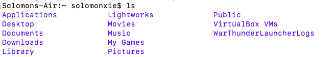

## 命令行添加文字颜色
> 不是终端的颜色主题，只加了颜色主题但是文字还是同样颜色，其实没什么用。主要就是要类似于语法高亮的功能，要不然命令行里源源不断的一页一页的字冒出来实在不好读。

### 方案一：直接添加Terminal的配置文件
Mac中和Linux是一样的，直接在本用户的根目录添加一个`.bash_profile`文件写入配置，打开颜色开关即可。
```shell
$ vi ~/.bash_profile
export CLICOLOR=1
```
但是效果不佳，开关顶多加上了`ls`文件夹的颜色，没什么大用。如图：

所以就需要再进一步找一个靠谱的解决方案。
