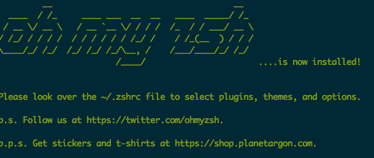
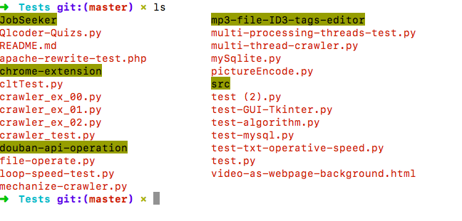
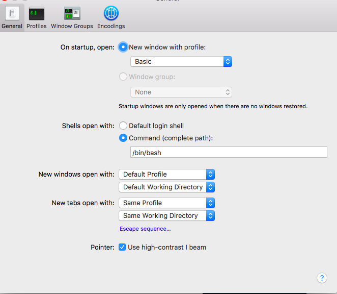

# ❖ Mac安装并配置zsh


> `zsh`原称为**Z Shell**。也是一种shell，兼容最常用的bash这种shell的命令和操作，并且有很多增强，超强的订制性。查来查去，bash虽然很标准，但是自己日常的话还是不要太偏执，力求简单方便的工具更好，所以就玩弄起了zsh。超漂亮又简单,也很好上手。

Mac原生就安装了zsh，linux的话需要安装一下，简单如`sudo apt-get install zsh`这样就安装好了。
可以先通过`cat /etc/shells`查看自己有哪些shell，一般都会有很多种。
使用方法很简单，直接在命令行里输入`zsh`就开始使用了。不过要变成每次打开终端默认使用zsh，则需要改配置。
### 安装`Oh My Zsh`
原本zsh就是很强大，但是配置超难，直到**Oh my zsh**工具出现，一切zsh的配置都变简单了。所以这是用zsh的必备工具，安装只需一句话：
```shell
sudo  curl -L https://raw.github.com/robbyrussell/oh-my-zsh/master/tools/install.sh | sh 
```
屏幕显示这个图，就算安装好了：



然后再打开终端，感觉一切都变了：直接进入zsh，命令行前一大串的用户名主机等都被隐藏了，进入git文件夹时前面也都加上了`git (master)`这样的带颜色分支字样，按Tab自动补全时也不用区分大小写了(太棒了)。。。如下图


有一点需要注意，安装完oh my zsh后，机子(Mac)上的Terminal会变成默认打开就进入zsh。如果不习惯的话，可以改回默认先。Mac的Terminal在设置里将`shell open with`改成`/bin/bash`就好了：

