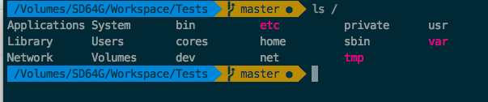
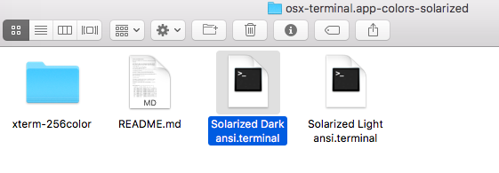
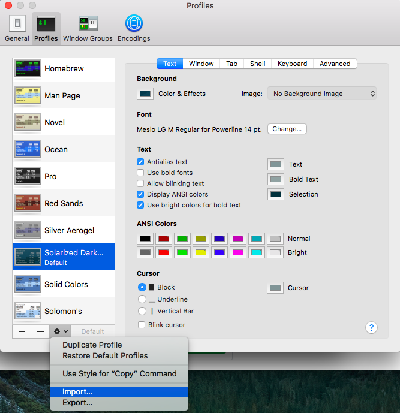
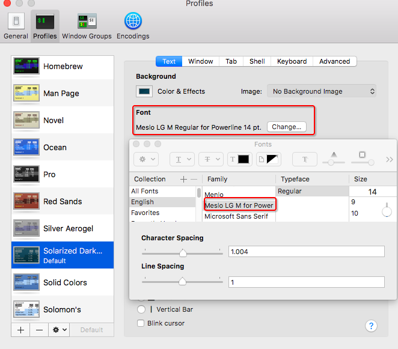
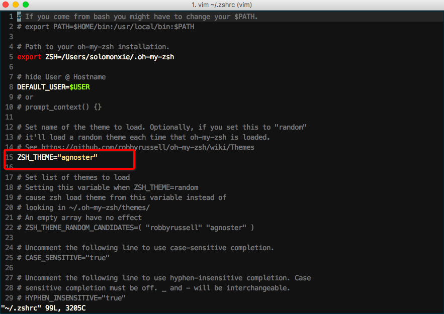
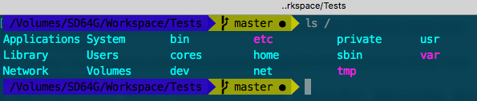
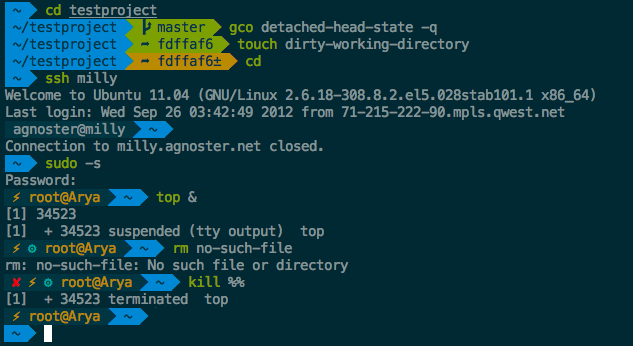

# ❖ Mac 终端配色方案 Color schemes

要想配置出这种好看的方案，标配就是：`zsh` + `Meslo字体` + `Soloarized Dark显示方案` + `Agnoster配色方案`。网上有很多文章介绍，不过这里也简单总结个cheatsheet方便以后用。
注：之前已经写了zsh和基本工具`oh my zsh`的安装方法了。后面都是在此基础上。



## 1. 安装Solarized显示方案 (仅用于本地客户端应用)

显示方案主要负责修饰命令行前缀，隐藏user@host，识别git文件夹，添加图标，命令高亮等。
去`Solarized`官网下载一个[zip压缩包](http://ethanschoonover.com/solarized/files/solarized.zip)。压缩包中包含了这种颜色方案应用在各种各样平台、终端、软件的配置文件。找到自己用的终端文件夹。如我用的是Mac Terminal，那么就在`osx-terminal.app-colors-solarized`这个文件夹，将里面的`Solarized Dark ansi.terminal`文件导入到终端。如下图：




在终端的配置里导入配色方案后，就出现了`Solarized Dark`选项，将其设为默认，重新打开终端，就出现基本的配色方案了。

## 2. 安装字体 （仅用于本地客户端应用）
Solarized配色包需要`Meslo LG M Regular for Powerline`这种字体才能显示各种特殊字符（图标），下载好ttf字体文件并安装。下载链接在这里[https://github.com/powerline/fonts/raw/master/Meslo%20Slashed/Meslo%20LG%20M%20Regular%20for%20Powerline.ttf](https://github.com/powerline/fonts/raw/master/Meslo%20Slashed/Meslo%20LG%20M%20Regular%20for%20Powerline.ttf)
装好以后，可以在终端中输入这个来测试是否成功：
```echo "\ue0b0 \u00b1 \ue0a0 \u27a6 \u2718 \u26a1 \u2699"```
如果能正常显示所有图标，则安装成功。
然后打开终端的偏好设置，在当前`Solarized`的配色方案下，找到字体选项，选择`Meslo LG M Regular for Powerline`字体，成功。



## 3. 设定Agnoster配色主题

不同于如Solarized显示方案，配色主题单纯负责颜色问题。
这个需要在Zsh配置文件`~/.zshrc`中配置，由于`agnoster`是Oh My Zsh工具自带，所以无需安装额外文件直接修改选项。
找到`~/.zshrc`文件，将`ZSH_THEME`变量改成`agnoster`，保存并重新打开终端即可。如下图：



最后，我在Mac终端上显示效果如下：



好像颜色哪里差了点，是因为它原生在iTerm终端才能发挥完全效果。效果如下：



iTerm的配置方法和Terminal.app非常相似，自己在偏好设置中采用类似的操作即可。
关于其它Oh My Zsh自带的色彩主题，可以到这里看效果：
[https://github.com/robbyrussell/oh-my-zsh/wiki/Themes](https://github.com/robbyrussell/oh-my-zsh/wiki/Themes)
