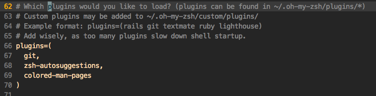

# Zsh 常用插件

> zsh有了各种插件后才真是如虎添翼，各种命令高亮，自动补全，命令参数辅助等。

## zsh插件安装方法

各种插件的安装方法各异，有的直接将插件文件夹拷贝到`~/.oh-my-zsh/custom/plugins`目录中，然后在`~/.zshrc`中的`plugins`数组中加入插件名即可；有的则需要配合别的工具并在`~/.zshrc`中加入别的命令。以下是几个常用的。
安装时经常会看到一些`$ZSH_xx`变量，这些都是zsh或oh my zsh设置的各种变量，便于插件运用。我们安装插件时也可以用这些变量安装，如插件保存的位置一般为`$ZSH_CUSTOM/plugins/插件文件夹名/`。


## `Oh my zsh自带插件`

自带插件在安装时就已经存在了，默认是只开启了git一个插件。其它的话也很简单，只需要在`~/.zshrc`文件中添加引用即可。打开文件找到`plugins`数组，然后把插件名加入数组即算开启。
如下图：



目前已经有的自带插件在官网Github中可以看到，[https://github.com/robbyrussell/oh-my-zsh/tree/master/plugins](https://github.com/robbyrussell/oh-my-zsh/tree/master/plugins)。
凡是这里有的，都可以立刻生效。


## Zsh命令自动补全插件 [zsh-autosuggestions](https://github.com/zsh-users/zsh-autosuggestions)

这里利用Oh my zsh的方法安装。直接一句话命令行里下载并移动到oh my zsh目录中：
```shell
git clone https://github.com/zsh-users/zsh-autosuggestions $ZSH_CUSTOM/plugins/zsh-autosuggestions
```
然后在`~/.zshrc`文件中找到plugins数组，加入`zsh-autosuggestions`名字，重新打开终端即可。


## Zsh命令语法高亮插件 [zsh-syntax-highlighting](https://github.com/zsh-users/zsh-syntax-highlighting)

将插件下载到oh my zsh的插件目录下的该新建插件同名文件夹中
```shell
git clone https://github.com/zsh-users/zsh-syntax-highlighting.git $ZSH_CUSTOM/plugins/zsh-syntax-highlighting
```
编辑`~/.zshrc`文件将然后将插件引用命令写入该文件最后一行（必须）
```
# Note the source command must be at the end of .zshrc
source "$ZSH_CUSTOM/plugins/zsh-syntax-highlighting/zsh-syntax-highlighting.zsh"
```
保存重新打开即可看到高亮的命令行了。


## Zsh自动跳转目录插件 [autojump](https://github.com/wting/autojump)

安装方法：
```shell
brew install autojump

# 未完待续...
```
