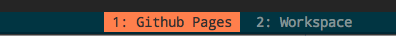

# ❖ Tmux的超绝便利 （基础篇）

> 上面提到服务器的任务不间断运行，就是利用了tmux的特性。就是说，一般ssh是断开就会停止所有之前连接ssh期间运行的所有processes，而tmux的核心业务不在于把屏幕分成几块好看，而是它能保存session！而且还能多端实时直播session！

了解tmux的安装和使用已经理解，这个[短视频](https://www.youtube.com/watch?v=BHhA_ZKjyxo)足矣！如果想试试tmux的session共享，让别的机器或别人像直播一样看你在命令行里打字、操作，也用tmux一句话即可，参考[这个视频](https://www.youtube.com/watch?v=norO25P7xHg)。

我万万没想到，将vim打造成IDE、将脚本不间断运行、让任务运行状态多处可观看的tmux，是这么简单。
一句`sudo apt-get install tmux`就安装好，一句`tmux`就开启，一句`tmux new -s <session-name>`就可以创建和保存session。超绝！

[常用操作快捷键参考。](https://gist.github.com/ryerh/14b7c24dfd623ef8edc7#%E5%90%8C%E6%AD%A5%E7%AA%97%E6%A0%BC)

## Tmux 重要概念

第一，Tmux中，千万不要去背和记长度超过**1个字母**的命令！所有都按照自己的顺手程度，在`.tmux.conf`配置文件中绑定快捷键，甚至窗口改变大小的命令也不用记，只需改为用鼠标调整即可。

第二，在Tmux逻辑中，分清楚**`Server > Session > Window > Pane`**这个大小和层级顺序是极其重要的，直接关系到工作效率：
- Server：是整个tmux的后台服务。有时候更改配置不生效，就要使用`tmux kill-server`来重启tmux。
- Session：是tmux的所有会话。我之前就错把这个session当成窗口用，造成了很多不便里。一把只要保存**一个**session就足够了。
- Window：相当于一个工作区，包含很多分屏，可以针对每种任务分一个Window。如下载一个Window，编程一个window。
- Pane：是在Window里面的小分屏。最常用也最好用。

了解了这个逻辑后，整个Tmux的使用和配置也就清晰了。

（ps：下面这种方便好看的Status bar状态栏，显示的是windows，而不是sessions）



## Tmux常用命令参考

```shell
#启动新session：
$ tmux [new -s 会话名 -n 窗口名]

#恢复session：
$ tmux at [-t 会话名]

#列出所有sessions：
$ tmux ls

#关闭session：
$ tmux kill-session -t 会话名

#关闭整个tmux服务器：
$ tmux kill-server
```

## Tmux 常用内部命令
> 所谓`内部命令`，就是进入**Tmux后**，并按下`前缀键`后的命令，一般前缀键为`Ctrl+b`. 虽然ctrl和b离得很远但是不建议改前缀键，因为别的键也不见得方便好记不冲突。还是记忆默认的比较可靠。

- 刷新配置文件：`<前缀键>r`
- 下载和更新Plugins：`<前缀键>I`
- Window 窗体：
    - 关闭当前Window: `<前缀键>&`
    - 创建新Window: `<前缀键>c`
    - 列出所有Windows: `<前缀键>w`
    - 后一个Window: `<前缀键>n`
    - 前一个Window: `<前缀键>p`
    - 重命名当前Window: `<前缀键>,`
    - 修改当前Window位置（序号）：`.`
- Pane 小面板：
    - 关闭当前Pane: `<前缀键>x`
    - 上下分割Pane: `<前缀键>%`
    - 左右分割Pane: `<前缀键>"`
    - 最大化/最小化 Pane: `<前缀键>z`
    - 显示每个Pane的编号，可以按下数字键选中Pane: `<前缀键>q` 
    - 与上一个窗格交换位置: `<前缀键>{`
    - 与下一个窗格交换位置: `<前缀键>}`
- Session 会话:
    - 启动新会话: `<前缀键>:new<回车>`
    - 列出所有会话: `<前缀键>s`
    - 重命名当前会话: `<前缀键>$`

## Tmux插件管理器（TPM: Tmux Package Manager）
[参考：TPM官网](https://github.com/tmux-plugins/tpm)

和vim一样的思路，需要先安装tmux专属的插件管理器，一般都是用这个：`tmux plugin manager`，即tpm。注意：文档里面都会提到`prefix + ...`，其中`prefix`指的是tmux的命令前缀，默认是`ctrl+b`。

按照官网的做法，很简单就安装上了，输入下面命令：
```shell
# 把管理器文件安装到`~/.tmux/plugins/tpm`之下 此前这些目录是不存在的
git clone https://github.com/tmux-plugins/tpm ~/.tmux/plugins/tpm

# 新建配置文件
vim ~/.tmux.conf

# 将下面内容复制到`~/.tmux.conf`
# List of plugins
set -g @plugin 'tmux-plugins/tpm'
set -g @plugin 'tmux-plugins/tmux-sensible'
# Other examples:
# set -g @plugin 'github_username/plugin_name'
# set -g @plugin 'git@github.com/user/plugin'
# set -g @plugin 'git@bitbucket.com/user/plugin'
# Initialize TMUX plugin manager (keep this line at the very bottom of tmux.conf)
run '~/.tmux/plugins/tpm/tpm' 
```

在tpm管理器已经安装的基础上:
- 我们直接到`~/.tmux.conf`文件里的`List of plugins`部分，写入插件名称
- 然后按`<前缀键>I`，这里面是大写的i，下载更新插件
- 再按`<前缀键>r` 重新加载配置文件

然后Tmux就完成配置更新了。


## `Tmux的配置文件`
配置文件默认位于`~/.tmux.conf`.
日常使用中，前缀键`Ctrl+b`和切换窗口键`Ctrl+o`等等，实在太麻烦了。所以改快捷键有时候是很必要的。
[参考这篇文档。](https://gist.github.com/ryerh/14b7c24dfd623ef8edc7#配置文件tmuxconf)

我的配置如下：
```vim
# 基础设置
#set -g default-terminal "screen-256color"
set -g default-terminal "xterm-256color"     # recover colorful terminal
set -g display-time 3000
set -g escape-time 0
set -g history-limit 65535
set -g base-index 1
set -g pane-base-index 1


# 前缀绑定 (Ctrl+a)
#set -g prefix ^a
#unbind ^b
#bind a send-prefix

# 启用鼠标(Tmux v2.1)
set -g mouse on

# 选中窗口
bind-key k select-pane -U
bind-key j select-pane -D
bind-key h select-pane -L
bind-key l select-pane -R

# copy-mode 将快捷键设置为 vi 模式
setw -g mode-keys vi

#<<<<<<<<<<<<<<<<<<<<<<<<<<<<<<<<<<<<<<<<<<<<<<<<
# Tmux Plugin Manager(Tmux v2.1)
#== TMUX PLUGIN MANAGER ==#
# Tmux Resurrect
set -g @plugin 'tmux-plugins/tmux-resurrect'

# List of plugins
set -g @plugin 'tmux-plugins/tpm'
set -g @plugin 'tmux-plugins/tmux-sensible'

# Initialize TMUX plugin manager (keep this line at the very bottom of tmux.conf)
run '~/.tmux/plugins/tpm/tpm'
#>>>>>>>>>>>>>>>>>>>>>>>>>>>>>>>>>>>>>>>>>>>>>>>>
```


## Tmux常见问题

## Tmux不管怎么改配置文件，都不产生变化
这个主要是由于Tmux的后台缓存机制造成的。我就犯了个大错误：甚至删了Tmux、重装Tmux、重启电脑，都没达成。
Tmux会有一个叫`Tmux-server`的东西。只要把它kill，重启tmux就OK了：
```sh
$ tmux kill-server -a
```


## Tmux无法持久保存session问题
它虽然好用，但是缺点是关机的话session就全都消失了。要解决这点，需要安装单独的插件。
这个时候你就需要`Tmux-Resurrect`插件来了，[地址在这](https://github.com/tmux-plugins/tmux-resurrect)。
插件说明里很清楚的写了，tmux一旦关机，就会失去一切的设置。所以还必须用插件来解决。


### Tmux中的vim等软件颜色丢失
这是因为tmux默认TERM没有用256color，那么每次运行tmux时指定color即可,`TERM=screen-256color-bce tmux`，或者更简单一点，在`~/.bash.profile`或者`~/.zshrc`中设置别名：
```
alias tmux="TERM=screen-256color-bce tmux"
```
然后在`~/.tmux.conf`文件中加入这句话：
```
set -g default-terminal "xterm-256color"
```

## Tmux中鼠标滚屏不能用
tmux中鼠标滚屏默认是关闭的，且不是很容易像开关一样开启支持。
看过了一些stackoverflow尝试了一些解决方案，发现没有一个管用。如果比这个还麻烦，暂时我就觉得没有必要再折腾了，直接用原生的屏幕滚动浏览快捷键即可：
`Prefix + [`，然后直接用上下箭头，或者`PnUp`和`PnDown`即可


## Tmux一打开就自动退出显示`[exited]`

这个是因为没有安装`reattach-to-user-namespace`且`.tmux.conf`中配置了`set-option -g default-command "reattach-to-user-namespace -l zsh"`造成的。

重新安装`reattach-to-user-namespace`即可：
```sh
$ brew install reattach-to-user-namespace
```
