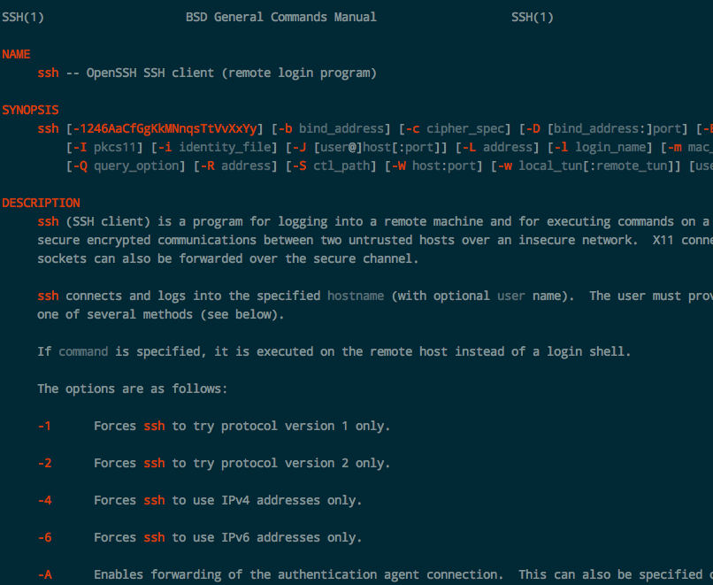
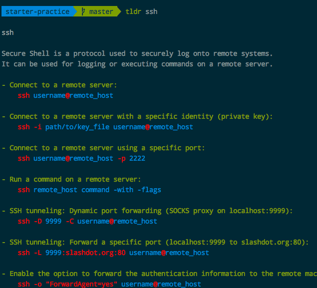
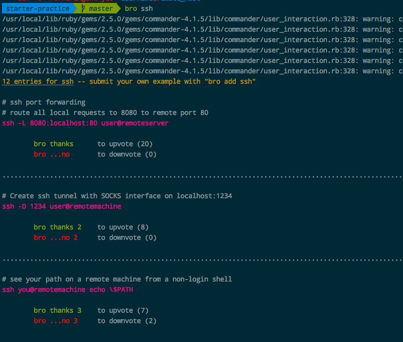

# Linux说明书/手册 `man page`
> 实际上不需要各种cheatsheet，Linux上自带就有手册，`man page`。

`man page`其实就是Manual Page的意思，使用方法是`man 命令`，然后就会显示某个命令的所有官方说明和用法。这个是基础中的基础。



但是苦于Man Page和历史上所有的说明书一样，实在是太官方太枯燥了，所以我们可以看到一些衍生品：

## `TLDR`
`TL;DR`的意思是Too long; Dont' read. 这个词在写文章时代表接下来要出现一个很长的内容了，但是在Linux中其实代表着相反的意思：把大长篇的说明简化为两三句话，直入重点展示命令的用法。


`tldr`是Linux命令行工具，[官网在此](https://github.com/tldr-pages/tldr/)。安装方式如下：
```
# Mac
brew install tldr

# Linux
sudo pip install tldr
```
注意：各种设备、平台上的安装方法都不同，请到官网看详情。

## [`bropage`](http://bropages.org/)
相当与`tldr`的社区版，即社区可以贡献每种命令的使用事例，然后通过投票方式排名。所以bropage每次执行都是需要联网查询的。


用法是：`bro 命令`
