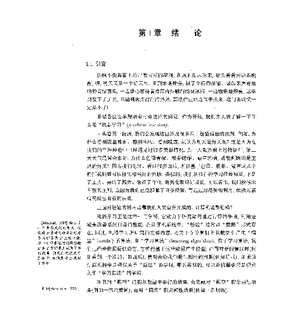

# ❖ Linux上强大的PDF工具集：ImageMagick 

`ImageMagick`是Linux上超强大、功能超丰富的图片处理的命令行工具。
而`ImageMagick`在做PDF相关的工作时，是基于`Ghostscript`进行处理的。所以两个都要安装。

首先确保本机已经安装ImageMagick与Ghostscript, 

Mac安装：
```sh
brew install ghostscript imagemagick
```

Ubuntu安装：
```sh
sudo apt-get install -y ghostscript imagemagick

# on error: sudo apt-get update
```

安装好后，命令行里就可以调用ImageMagick的一系列命令了，包括：
- convert

常用命令有：
```sh
#JPG图片转为PNG图片
$ convert image.jpg image.png

#将图片缩放为50%大小
$ convert image.png -resize 50% image2.png

#将图片缩放为指定长宽
$ convert image.png -resize 640x480 image2.png

#横向合并图片
$ convert image1.png image2.png image3.png +append image123.png
```

## PDF转图片

用`imagemagick`将pdf转成图片（不是提取图片）的命令是：
```sh
$ convert sample.pdf sample.jpg
```

命令非常简单，速度也极快。但是在PDF转图片的过程中，如果不加任何设置直接`convert xx.pdf xx.png`这样的转换，效果可是**非常之差**，如下图：



注意：一般如果设置输出为png的话，程序会提出警告：
convert: profile 'icc': 'RGB ': RGB color space not permitted on grayscale PNG sample-default-convert.png' @ warning/png.c/MagickPNGWarningHandler/1744.
这是因为程序没有很好支持`PNG`格式图片的问题。虽然报错，但是png文件也能正常生成。如果不喜欢的话，就改成`JPG`格式输出好了。

### Resolution 清晰度设置
`convert`命令将PDF转图片的最大难度在于清晰度问题。网上有很多种解决方案，各有优缺。

以下为一些尝试的总结：

```sh
# 默认转换：图片大小几乎与pdf相同
$ convert sample.pdf sample.jpg

# resize设置：无论resize 100还是3000，都没有清晰化
$ convert -resize 3000 sample.pdf sample.jpg

# quality设置：完全没有作用
$ convert -quality 100% sample.pdf sample.jpg

# verbose+density+quality+flatten+sharpen转换：也就大概还原了80%的清晰度
$ convert -verbose -density 150 -trim -quality 100 -flatten -sharpen 0x1.0 sample.pdf sample.jpg

# density 300转换：100%还原，但是文件增大10倍
$ convert -density 300 -trim -quality 100 sample.pdf sample.jpg

# geometry 转换：100%还原，文件增大7倍
$ convert -geometry 1600x1600 -density 200x200 -quality 100 sample.pdf sample.jpg
```

总结：经过各种考察，中外网友对`convert`转换图片的清晰度设置，也全都在猜的阶段。而且设置都太固定，并不能稳定保证所有的PDF都转换成一样的清晰度。
所以问题需要转换另一个思路去解决：
直接提取PDF中的原画，这样就100%是原画质了。
而且一般对于扫描书籍的PDF来说，全页只有一个图片，所以用`pdfimages`就比较好解决。

这个需要另一个命令行工具`pdfimages`来做到了。
请参考另一篇相关笔记。


## 批量图片合并为PDF

```sh
cd /path/to/images/
convert "*.{png,jpeg,jpg}" -quality 100 outfile.pdf
```
