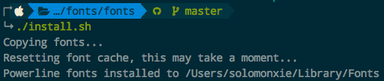
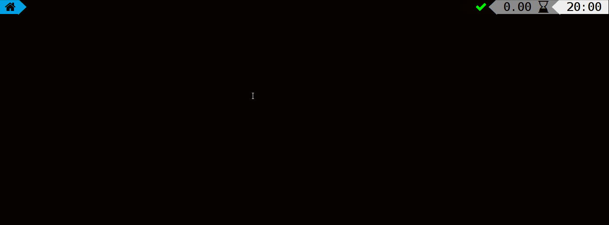

# ❖ ZSH终极美化

## 终端专用字体
终端美化不管是什么方案，都少不了的就是炫丽的字体安装。
这个就是OS系统级别的东西了，所以我们要对在电脑系统里面安装。
可以手动下载主题包，然后双击打开装到自己的电脑里（Mac、Windows、Linux）。
如果是Mac和Linux，也可以在命令行里完成。
程序员几乎需要的所有字体都在这个repo里了：
- [`❖参考Github：Nerd-fonts`](https://github.com/ryanoasis/nerd-fonts)
- [`❖参考Github：powerline/fonts`](https://github.com/powerline/fonts)


安装方法：
```sh
# 下载
cd ~
git clone https://github.com/powerline/fonts.git --depth=1
# 到该目录下执行安装。Mac、Linux都可以
cd fonts
./install.sh
# 删除刚刚下载的
cd ..
rm -rf fonts
```
安装完成后显示：



## 经典的Agnoster主题

[参考Github：agnoster/agnoster-zsh-theme](https://github.com/agnoster/agnoster-zsh-theme)


要正常显示出`Agnoster`主题效果，需满足以下几点：
- 终端客户端开启Solarized配色方案
- 支持Unicode-compatible 的字体和终端 (比如Mac上的iTerm2终端客户端 + Menlo字体)

安装方法：
```sh
# 下载主题文件到`oh-my-zsh`的主题目录
$ wget https://raw.githubusercontent.com/agnoster/agnoster-zsh-theme/master/agnoster.zsh-theme -P ~/.oh-my-zsh/themes/

# 在`~/.zshrc`中开启主题：
ZSH_THEME="agnoster" 

# 安装主题所需的字体(需要Powerline-patched font ）
```


## 超帅的Powerlevel9k主题

[参考Github：bhilburn/powerlevel9k](https://github.com/bhilburn/powerlevel9k)



首先注意：字体目前测试可用的有：
- `Droid Sans Mono Nerd Font Complete.otf`，可以到Nerd-font的github下载。

最方便的安装方法是用`oh-my-zsh`安装，方法如下：
```sh
# 下载主题包到oh-my-zsh目录下
$ git clone https://github.com/bhilburn/powerlevel9k.git ~/.oh-my-zsh/custom/themes/powerlevel9k

# 在`~/.zshrc`中开启主题
ZSH_THEME="powerlevel9k/powerlevel9k"

# 安装主题所需的字体（需要在电脑上安装Powerline字体）

```
