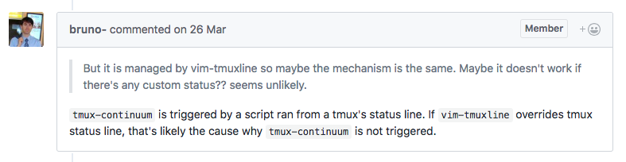

# ❖ Tmux Like a Boss [DRAFT]

[进阶参考：10 Killer Tmux Tips](https://www.sitepoint.com/10-killer-tmux-tips/)

## Tmux会话自动保存
Tmux会话是整个tmux中最最最重要的东西。在tmux中创建多个window，且合理分配窗格，是让tmux运用如飞的核心。但是关机重启电脑后tmux-server服务器也重启了，session就会消失。这绝对是不能允许的，因为一次重启就让之前所有的窗格设计全消失肯定不行。

所以，tmux的会话保存是tmux 101第一课。
这里主要就是用两个插件：`tmux-resurrect`保存会话，然后加上`tmux-continuum`来自动保存运行resurrect。

### tmux-resurrect

[参考Github: tmux-resurrect](https://github.com/tmux-plugins/tmux-resurrect)

由于tmux不能持久保存session的特性，我们需要安装这个插件来将session的设置完全保存到本地，然后重启后也能够快速恢复窗口等设置的内容。
首先在`~/.tmux.conf`文件的`List of plugins`部分加入这句话：
```
set -g @plugin 'tmux-plugins/tmux-resurrect'
```
保存好后，在tmux的任意窗口按`<前缀键>I` (注意是大写的i)，即可完成下载安装。

用法:
- `<前缀键>Ctrl-s` - 保存session
- `<前缀键>Ctrl-r` - 恢复session

重要缺陷：
- 不能自动保存session，忘记手动保存的话，重启后就会消失
- 很多内置功能(鼠标支持)和插件只支持Tmux 2.1版本，像树莓派这样只能装tmux 1.9的就不能用

Bug发现：
- 以下这两个tmux的配置语句一定要慎用慎用！因为很容易产生所有窗格出现各种错乱，非常麻烦。而且为了保存命令历史和屏幕内容，会在本地生成大批量文件甚至包括压缩包
```sh
set -g @resurrect-save-bash-history 'on'  # 保存命令历史
set -g @resurrect-capture-pane-contents 'on'  # 保存屏幕内容
```

对于自动保存的问题，tmux-resurrect官方推荐另一个插件：`tmux-continuum`。非常好用，定期自动帮你保存session，电脑关机重启的话，打开tmux后会第一时间恢复上一次的session。

### tmux-continuum

[参考Github： tmux-continuum](https://github.com/tmux-plugins/tmux-continuum)

Continuum会默认每15分钟调用一次tmux-resurrect插件的保存功能。可以自己改成5分钟。
但是不用担心太多保存文件占用空间，continuum只在tmux窗格发生变动时才保存。而且每个文件才5k，不占多少地方。


#### 常见问题：continuum无法自动保存

有时候可以自动保存很方便，但是很多时候总是无法自动保存。
参考[官方Github的issues](https://github.com/tmux-plugins/tmux-continuum/issues/22)，
作者说，tmux-continuum是由`Status bar`中触发continuum的脚本从而达到自动保存的作用，所以很有可能在修改tmux状态栏时候，产生了冲突造成continuum不生效。



根据经验，`.tmux.conf`的其它所有改动都可以在`<前缀键>r`后立即生效，
**唯独修改continuum相关设置，必须杀死所有tmux相关进程和session后才会生效。**
记住这点，会省很多时间。

解决方案：
- 开始的话有可能本地没有下载continuum的文件，用`<前缀键>I`下载。
- Debug：
    - 修改Tmux状态栏显示当前continuum状态`set -g status-right 'Continuum: #{continuum_status}'`
    - 关闭continuum: `set -g @continuum-restore 'on'` 然后重新加载，看状态栏有没有改变
    - 如果重新加载没有改变continuum状态，则需要关闭tmux，一定要两种方法都用，少一个都没效果：
        - `tmux kill-server`
        - `pkill -9 tmux`
    - 再看看continuum状态是否发生变化，如果有变化则把它改成`on`，再重新加载
    - 到这一步一般能解决问题了
- 手动写脚本或发命令：
```sh
~/.tmux/plugins/tmux-continuum/scripts/continuum_save.sh
```

一般如果能正常重启，就都能解决了。

### tmuxinator

网上几乎所有人都在说这个是tmux的最佳伴侣。
但是我看了一圈后发现这几个一开始就不让人喜欢的特性：
- 必须在系统基础上安装单独的软件`tmuxinator`
- 重度依赖Ruby环境
- 所有window的设计都必须手动写Yaml文档来创建
- 包括每个窗格的大小都要在配置文件里写入数字来保存

看到这里，我就放弃了安装它的念头了。


## Tmux常用插件集合

### tmux-sensible


### tmux-yank

