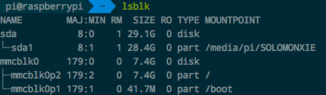
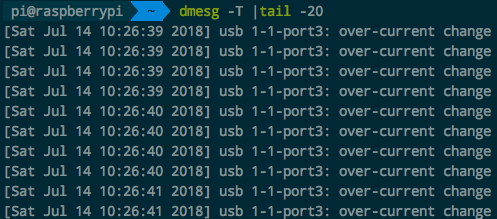
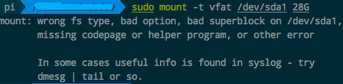

# ❖ 树莓派／Ubuntu 挂载外置存储

```sh
$ mount -t deviceFileFormat -o umask=filePermissons,gid=ownerGroupID,uid=ownerID /device /mountpoint

# 可选-o 模式
rw,suid,dev,exec,auto,nouser,async
```

## 树莓派挂载U盘
[参考文章](https://segmentfault.com/a/1190000014173634)

```shell
# 检查设备名字
$ df -h
# 或详细展示已连接设备，包括文件系统等信息 (没有sudo无法使用fdisk)
$ sudo fdisk -l

# 设定映射目录
$ sudo mkdir /media/pi/udisk
# 将指定设备映射到刚刚创建到目录
$ sudo mount /dev/sda1 /media/pi/udisk

# 开机自动执行
$ sudo vim /etc/rc.local
# 将下面这句加到文件内容中(rc.local最后的exit 0之前都行)
$ mount -o uid=pi,gid=pi /dev/sda1 /media/pi/udisk

# 取消挂载优盘（不是reject弹出）
$ sudo umount /dev/sda1
```

## 树莓派挂载FAT32格式的U盘
如果是默认挂载的话，FAT32的U盘在Linux上是只读的，所以必须要指定用户、用户组、读写权限、设备类型等：

```sh
$ sudo mount -t vfat -o rw,uid=pi,gid=pi /dev/sda1 /media/pi/udisk
```


## 树莓派挂载NTFS格式移动硬盘

```sh
# 安装ntfs-3g程序
$ sudo apt-get install ntfs-3g

# 先查找当前已经插上的NTFS格式硬盘的设备位置，如：/dev/sda1
$ sudo fdisk -l | grep NTFS

# 随便找个地方建立一个空目录，用来映射硬盘内容
$ sudo mkdir ~/drive

# 挂载硬盘
$ sudo mount -t ntfs-3g /dev/sda1 ~/drive
# 或
$ ntfs-3g /dev/sda1 ~/drive
```

由于NTFS格式不支持Unix系列的用户组策略，所以默认都是root用户，无法修改所有者。
所以我们可以在挂载的时候选择所有者达到目的：
```sh
$ ntfs-3g /dev/sda1 /media/pi/drive -o gid=6001, uid=6001
```


## 指定挂载磁盘的用户、组、权限
同样是编辑`/etc/fstab`，在第一个参数处添加`uid=用户名,gid=组名`即可。示例：
```sh
UUID=5B7D-9E47 /media/pi/udisk exfat nofail,uid=root,gid=root 0 2
```
保存退出后，需要`umount`卸载再`mount`挂载。

## 树莓派挂载exFat格式硬盘
如果移动硬盘是exFAT格式，那么`mount`命令无法正常挂载这个移动硬盘。
所以我们需要安装`exfat-fuse`插件，让`mount`支持这个格式：
```sh
# 安装支持exfat系统的程序 
# 树莓派：
$ sudo apt-get install exfat-fuse

# 如果是Ubuntu就用这个：
#$ sudo apt-get install exfat-utils

# 挂载硬盘
$ sudo mount -t exfat /dev/sda1 ~/drive
```


## 常用硬盘调试命令

显示所有正常连接的存储设备：
```sh
$ lsblk
```
这个命令可以看到有那些外置盘连接上了，有没有映射，映射到哪个目录。


显示一切硬件连接的流水账信息：
```sh
# 显示最新的20条信息 且友好的输出时间(-T)
$ dmesg -T | tail -20

# 显示所有SD卡或U盘相关
$ dmesg |grep sda

# 显示一切USB相关
$ dmesg |grep usb
```
这个显示出刚刚插上的USB设备出了问题：供电不足



## 禁止树莓派自动挂载
我自己挂载的目录失效，树莓派自动挂载到另一个目录。
这是树莓派自动的，就像Windows一样插上硬盘就会挂载成一个驱动盘。
但是这个不方便我们操作，因为目录和路径图都是不确定的，所以就关闭掉树莓派自动挂载。

[参考：禁止u盘自动弹出](https://blog.csdn.net/luckywang1103/article/details/50829812)

```sh
# 查看各个设备的uuid号
$ ls -l /dev/disk/by-uuid/
lrwxrwxrwx 1 root root 10  6月 27 16:24 0000678400004823 -> ../../sdb1

#  在fstab中关闭这个设备的自动挂载 noauto
$ vim /etc/fstab

UUID=0000678400004823 /media vfat noauto 0 0
```

注意：如果设置成了`noauto`，那么就无法用`mount -a`全部挂载了。


## 开机重启后自动挂载外置存储
由于`/dev/sda1`这个位置是不固定的，每次都是随机分配的，所以无法在开机根据这个位置来挂载U盘。
但是每个U盘都是有自己的唯一名称的：`UUID`，我们可以用这个ID进行挂载。

首先，要查看每个设备的UUID：
```sh
$ ls -l /dev/disk/by-uuid
>>> lrwxrwxrwx 1 root root 10  6月 27 16:24 0000678400004823 -> ../../sdb1
```

知道这个UUID是0000678400004823后，我们就在`/etc/fstab`中指定它和某个文件夹的关联（注意是关联而不是挂载）：
```
UUID=0000678400004823 /udisk exfat nofail 0 2
```
保存退出后，再到`/etc/rc.local`中加入挂载命令：
```sh
sudo mount -a
```

> `mount -a`代表挂载所有”已经已知的或在fstab中定义过的设备“。反过来`umount -a`是取消挂载所有设备。

重启后就可以看到所有定义过的设备都自动挂载到指定的目录了。

当然，如果不愿意开机自动挂载，那么如果已经在`fstab`中定义过关联了，你只需要简单的输入`sudo mount /udisk`即可完成挂载。


## 常见问题

## 挂载的U盘或磁盘变成只读

最常见的原因是：
> 在`mount`时候，没有指定，或者没有正确指定磁盘的格式。所以才会只读。

如果不管怎么`chmod`、`chown`、`mount -o rw`，都不管用的话，那就是磁盘本身的问题了。
通过以下`dosfsck`文件系统错误修复命令瞬间修复：
```sh
# 先卸载磁盘 (比如磁盘sda1）
$ sudo umount /dev/sda1

# 修复磁盘
$ sudo dosfsck  -v -a /dev/sda1
```

## `显示U盘文件系统出错`



## `显示Input/output error错误并无法读取设备`
这个经常出现在大批量读取U盘或移动硬盘时，突然掉线导致的，可能是设备老化吧。
这个时候，无法读取部分或所有目录，甚至无法挂载在原先的目录。
这种时候，最快捷的就是重启。或者挂载到另一个目录。


## `mount 映射时显示 Transport endpoint is not connected`
这个是在`mount`命令挂载的过程中出现的错误。
一般是被映射的空目录本身出了问题，所以只要删除这个目录，或者换个地方再映射，就好了。
如果删不掉这个目录，就重启一下就可以删了。

## `弹出硬盘时显示 Target Busy`
看看有没有哪个设备正在连接这个目录，有的话就关掉。
或者重启电脑。

```sh
sudo fuser -k /dev/sda1
```
