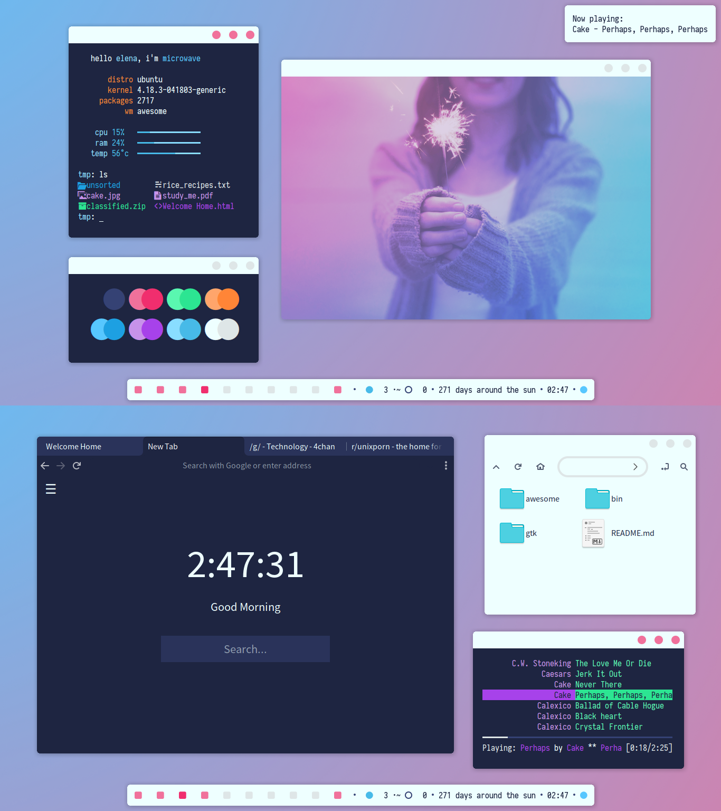

# Awesome Window Manager 超帅Linux新型桌面 [DRAFT]

> 最近总是在Reddit上看Arch Linux的人炫桌面截图。确实很帅很现代化，极简风格。查了下，原来是一个叫`Awesome`的桌面管理器，替代传统的Gnome/Unity等等难看桌面，而且据说这个桌面极快、极小、高度可定制。

[参考官网：Awesome Window Manager](https://awesomewm.org/)



## 安装

Ubuntu安装如下：
```
```

