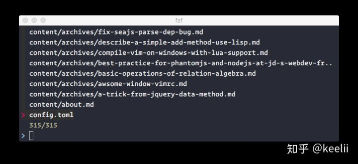
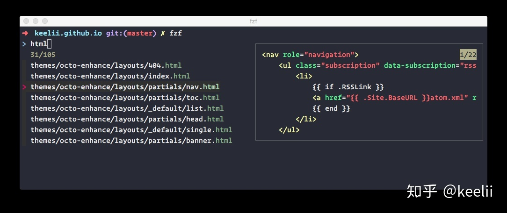

# ❖ CLI命令行模糊搜索的超强大工具：fzf

[参考官方：junegunn/fzf](https://github.com/junegunn/fzf)
[参考：Fuzzy finder(fzf+vim) 使用全指南](https://zhuanlan.zhihu.com/p/41859976)
[参考：模糊搜索神器fzf](https://segmentfault.com/a/1190000011328080)




无需复杂配置，非常简单就能使用：
```sh
git clone --depth 1 https://github.com/junegunn/fzf.git ~/.fzf
~/.fzf/install
```

安装过程，只是简单的分别在`zshrc`和`bashrc`等各个shell的配置文件中加入如下内容（已简化）：
```sh
# 将可执行文件加入PATH
if [[ ! "$PATH" == *~/.fzf/bin* ]]; then export PATH="$PATH:$HOME/.fzf/bin"; fi
# 引入shell中的"**"符号自动补全
[[ $- == *i* ]] && source "$HOME/.fzf/shell/completion.zsh" 2> /dev/null  # Auto-completion
# 引入shell中的快捷键设置
source "$HOME/.fzf/shell/key-bindings.zsh" # Key bindings
# 外观设置（高亮、预览、高度）
export FZF_DEFAULT_OPTS="--height 40% --layout=reverse --preview '(highlight -O ansi {} || cat {}) 2> /dev/null | head -500'"
```

安装好后，直接调用`fzf`即可打开搜索。

为了更方便，我们应该在zsh或bash的配置文件中加入`alias fzf="~/.fzf/bin/fzf"`

输入fzf命令后，自动会显示出搜索框。基本操作命令如下：
- 上下移动：Ctrl+J / K 或 Ctrl+N / P
- 退出：Enter键选中，或 Esc，或Ctrl+c， 或Ctrl+g
- 多选：在多选模式下（-m), TAB和Shift-TAB用来多选
- 鼠标: 上下滚动，双击选中； Shift-click或shift-scoll用于多选模式
- 预览：shift+上／下键，滚动预览内容

## 使用命令

`fzf`命令在搜索后，当你选择时，只会返回你这个文件的全路径字符串。也就是：`fzf默认会从STDIN读入数据，然后将结果输出到STDOUT`

我们当然不能拿字符串来做什么。所以还是要配合各种文字编辑、shell命令等来使用。

用VIM编辑搜索到的结果文件：
```sh
$ vim $(fzf)

# 可以将alias设置为：
alias vfzf="vim $(fzf)"
```
效果如下：


切换到某个目录，可以完成切换到当前以下任意目录的效果：
```sh
$ cd $(find * -type d | fzf)

# 建议alias设置：
alias dfzf="cd $(find * -type d | fzf)"
```

每次移动光标，可以快速看到文件预览：
```sh
$ fzf --preview 'head -100 {}'
```
效果如下：



## 配置

如果要更方便的使用fzf，而不输入那么多命令，那就直接在shell的配置里加一个环境变量即可。

这个环境变量名叫`FZF_DEFAULT_OPTS`，所有fzf的配置都写在这一个变量里：
```
export FZF_DEFAULT_OPTS="--height 40% --layout=reverse --preview '(highlight -O ansi {} || cat {}) 2> /dev/null | head -500'"
```

由于fzf安装时候会自动在你的`zshrc`或`bashrc`中加入`[ -f ~/.fzf.zsh ] && source ~/.fzf.zsh`，不是很直观。如果想更直观更可控，可以直接把`.fzf.zsh`中为数不多的内容复制到`zshrc`中集中管理：
```sh
# Setup fzf Searching tool {
    # Import binary execution to PATH
    if [[ ! "$PATH" == *~/.fzf/bin* ]]; then export PATH="$PATH:$HOME/.fzf/bin"; fi
    # Import key bindings for auto completion
    [[ $- == *i* ]] && source "$HOME/.fzf/shell/completion.zsh" 2> /dev/null
    # Import specific key bindings
    source "$HOME/.fzf/shell/key-bindings.zsh"
    # Setup appearence (Highlighting, scale, preview...)
    export FZF_DEFAULT_OPTS="--height 40% --layout=reverse --preview '(highlight -O ansi {} || cat {}) 2> /dev/null | head -500'"
# }
```


## 搜索语法
