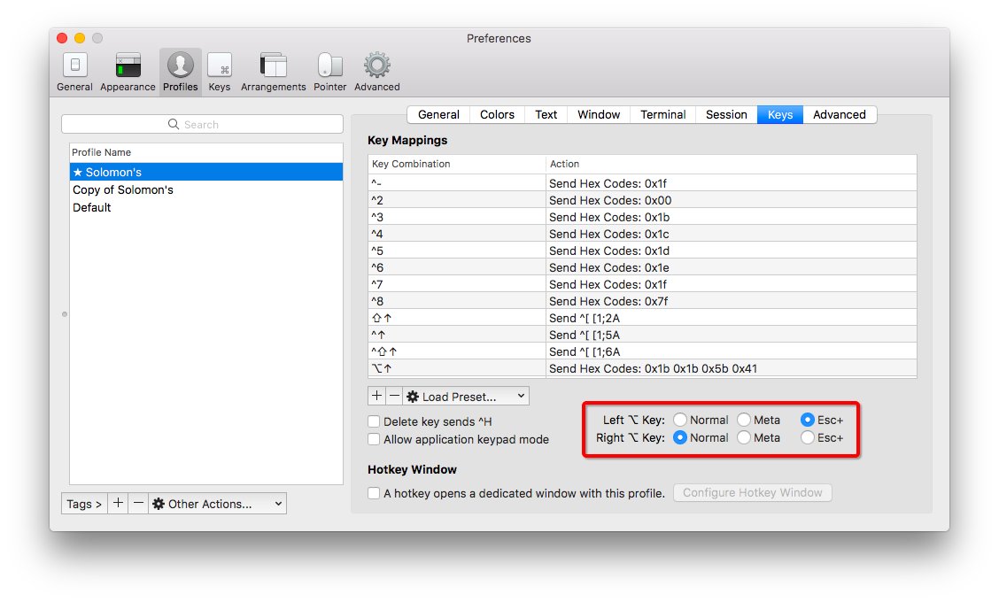

# `<M-e>`键的问题

初看，并不明白<M>在键盘上是什么？Google了很久也查不到。最后终于在查关键字`Vim Key Notation`发现了，原来`<M>`代表`Meta key`，在很多终端或平台是不支持的。偶尔有支持的，那就是Alt键。这个时候，它和`<A-..>`是同样的意思。

但是，自动补全括号中，有一个`fast wrap`功能，需要用到`<M-e>`键，即`Alt-e`键。可是不管怎么按，在insert还是normal模式按，都只会输出一个奇怪符号`´`，而不执行命令。

为什么？
因为`Alt`快捷键，在很多Terminal或平台都是不支持的，比如Mac的终端。

经过一番查询，Mac的iTerm2可以将Alt(Option)键映射为Meta键。
位置为：Preference -> Profiles -> Keys -> Left Option key -> `ESC+`.

