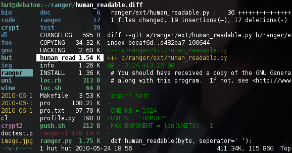
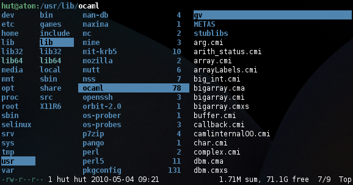
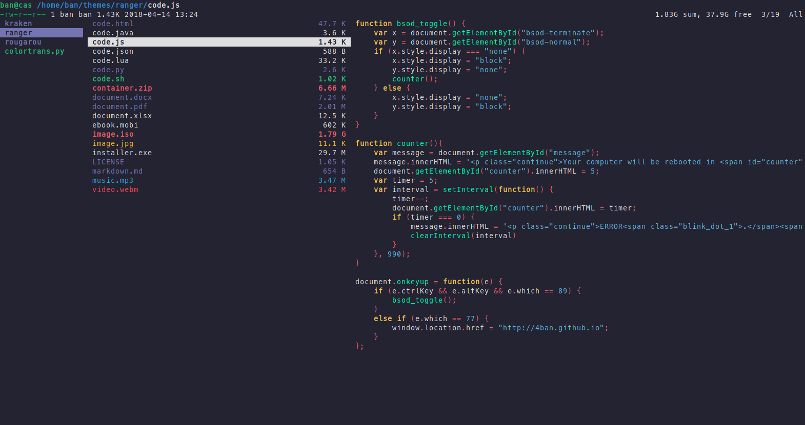
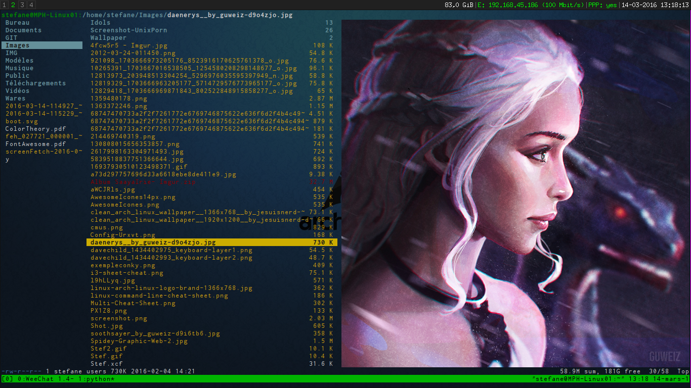
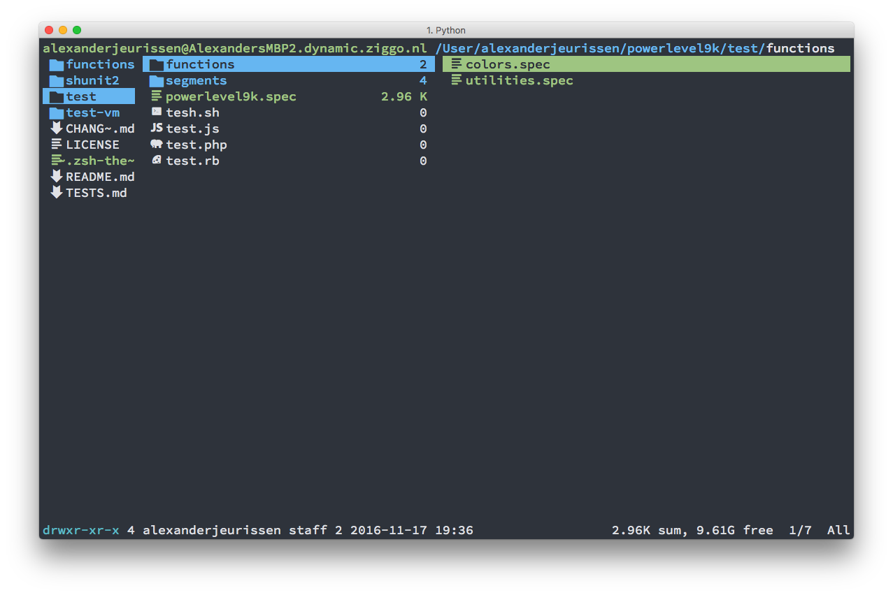

# Ranger：帅气强大的命令行文件管理器 [DRAFT]

> `Ranger`是一个极轻量(700k)又像VIM一样高可配置的命令行文件管理器，用起来很多时候比桌面上的文件夹方便多了。

[参考：Installing and Using Ranger, a Terminal File Manager, on a Ubuntu VPS](https://www.digitalocean.com/community/tutorials/installing-and-using-ranger-a-terminal-file-manager-on-a-ubuntu-vps)
[参考官方：ranger/ranger - A VIM-inspired filemanager for the console](https://github.com/ranger/ranger)
[参考Luke Smith： RANGER: the aesthetic way to manage files on Linux ](https://www.youtube.com/watch?v=L6Vu7WPkoJo)

为什么要用`Ranger`？
因为终端里，你可能真的会厌倦了各自cd, cp, mv, rm等等。如果有桌面上那种快捷又直观的方式，加上各自超级方便如Vim的快捷键，你肯定会乐于接受。

`Ranger`就是这种能给你带来终端里舒服体验的轻量又强大的文件管理器。




Mac安装：
```sh
$ brew install ranger
```

Ubuntu安装：
```sh
$ sudo apt-get install ranger
```

运行：
```sh
$ ranger
```

刚刚安装好后，颜色都是默认的：




## 基本使用

通用快捷键：
- `?` 显示帮助
- `1?` 快捷键帮助
- `2?` 命令帮助
- `3?` 设置帮助
- `S` 进入当前文件夹 (前提是要按Enter选择文件夹)
- `R` 重新加载当前文件夹
- `Q` 退出

移动键：
- `h`,`j`,`k`,`l` 上下左右移动。和Vim一样，很快就能学会
- `J`, `K` 向上或向下翻半页
- `H`, `L` 根据历史向前或向后跳转
- `gg`到顶部，`G`到底部
- `<Ctrl>-b`向上翻页Backward，`<Ctrl>-f`向下翻页Forward

文件夹操作：
- `gh`  = cd ~
- `gge` = cd /etc
- `ggu` = cd /usr
- `ggd` = cd /dev
- `ggo` = cd /opt
- `ggv` = cd /var
- `ggm` = cd /media
- `ggM` = cd /mnt
- `ggs` = cd /srv
- `ggr` = cd /
- `ggR` = cd to ranger's global configuration directory

文件操作：
- `i` 预览文件
- `E` 打开文件（用终端默认程序，如Vim）
- `r` 打开文件（提示输入用哪种命令行程序打开）
- `o` 改变排列方法（会弹出排序选项）
- `z` 更改设定
- `zh` 显示/隐藏文件
- `<space>` 选择当前文件
- `t` 给文件打上tag标记
- `cw` 重命名文件
- `/` 搜索文件
- `n` 跳至下一个搜索的匹配文件
- `N` 跳至上一个搜索的匹配文件
- `yy` 复制文件
- `dd` 剪切文件
- `dD` 删除文件
- `I`或`A` 文件改名

Tab标签窗口：
- `<Ctrl>-n` 创建新Tab
- `<Ctrl>-w` 关闭当前Tab
- `<Tab>` 下一个Tab
- `<Shift><Tab>`  前一个Tab

在Shell中cd进入Ranger选中的文件夹路径：
> 按`S` （大写），ranger就会退出，并且在shell中cd进入该路径。


## 基本配置

[参考详细配置：ranger - Archlinux](https://wiki.archlinux.org/index.php/ranger)

首先需要“生成配置文件“：
```sh
$ ranger --copy-config=all
```

然后ranger就会把系统级的配置文件保存的当前用户文件夹下的`~/.config/ranger/`目录中。其中包括5个配置文件：
- `apps.py`
- `commands.py`
- `rc.conf` 主要配置文件，如同vimrc
- `options.py`
- `scope.sh` 用来设定如何预览各种文件的，包括图片


## 色彩配置

如同Vim一样，可以直接按`:`输入命令，查看效果，确定后再写入配置文件。

设置颜色主题的命令和vim一样：`set colorscheme NAME`。
默认的主题只有：default, jungle, snow, **solarized**.

自定义的主题放在`~/.config/ranger/colorschemes/`文件夹中即可识别。


去哪找主题？
官方并没有推荐任何主题网站，也没有说明任何主题安装方法等。
通过摸索发现，不要搜~~ranger colorscheme~~，而是在Github搜索`ranger theme`即可获得各种主题。

安装第三方主题方法：
只要把`xx.py`拷贝至`~/.config/ranger/colorschemes/`文件夹下即可。然后在`rc.conf`中设定主题名称。

推荐一款主题：[`RougarouTheme/ranger`](https://github.com/RougarouTheme/ranger)




安装方法：
```sh
mkdir -p ~/.config/ranger/colorschemes/
wget https://raw.githubusercontent.com/RougarouTheme/ranger/master/rougarou.py -P ~/.config/ranger/colorschemes/
```
然后在`~/.config/ranger/rc.conf`中的主题设定处改为`set colorscheme rougarou`，重启ranger即可。


## 插件安装使用


Ranger可以有很多种在命令行下预览图片等文件的方法，这都需要安装第三方程序才行。

[参考：ranger的配置与使用](http://yinflying.top/2017/04/414)

Ubuntu上，可以安装这些插件进行预览：
```sh
$ sudo apt-get install caca-utils # img2txt 图片
$ sudo apt-get install highlight  # 代码高亮
$ sudo apt-get install atool　    # 存档预览
$ sudo apt-get install w3m        # html页面预览
$ sudo apt-get install poppler    # pdf预览
$ sudo apt-get install mediainfo  # 多媒体文件预览
$ sudo apt-get install catdoc     # doc预览
$ sudo apt-get install docx2txt   # docx预览
$ sudo apt-get install xlsx2csv   # xlsx预览
```

### 图片预览 [DRAFT]



全真彩色图片的预览，需要第三方的支持：
- Linux上，需要安装`w3m`命令行浏览器才有。
- Mac上，直接用iTerm2即可实现全彩色预览。


## 添加文件图标：ranger_devicons插件

[参考官方：alexanderjeurissen/ranger_devicons](https://github.com/alexanderjeurissen/ranger_devicons)




添加插件方法：
```sh
cd /tmp
git clone https://github.com/alexanderjeurissen/ranger_devicons.git
cd ranger_devicons/
make install && echo [  OK  ]

# UNINSTALL
# make uninstall
```


体验：
非常简单也非常好看。安装方便、卸载方便。虽说是`make install`，但其实什么都没编译只是自动在`rc.conf`中加入相应内容而已。

只有一个问题，比如Vim中嵌入了Ranger插件，那么图标就会显示乱码。

