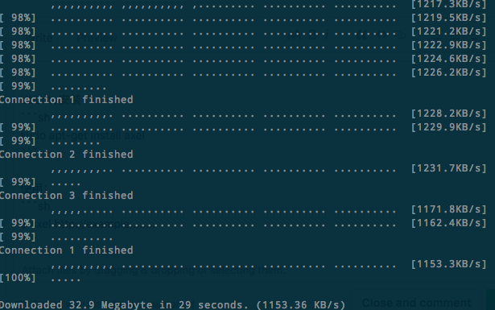

# ❖ Awesome Linux Lightweight Programs [DRAFT]


## Axel 超强超速多线程的下载器 代替wget

Mac安装：
```sh
brew install axel
```

Ubuntu安装：
```sh
sudo apt-get install axel
```

使用：
```sh
$ axel <URL>
```

指定线程数：
```sh
$ axel -n 10 <URL>
```


效果：




如果遇到`SSL error: certificate verify failed`错误，解决方法是`-k`参数“禁止安全检查“，相当于wget的`--no-check-certificate`，方法如下：
```sh
$ axel -k <URL>
```
