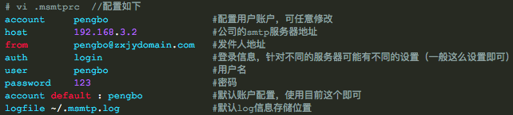
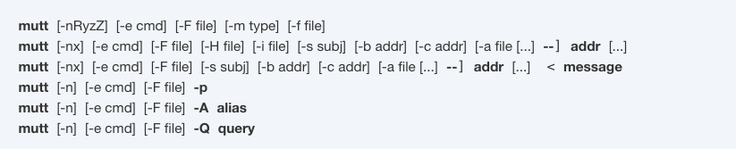
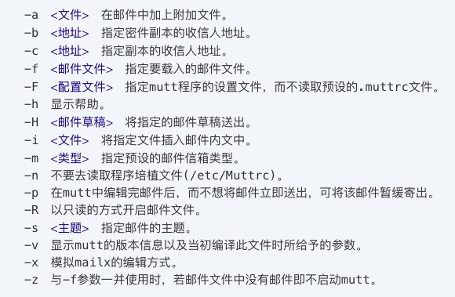
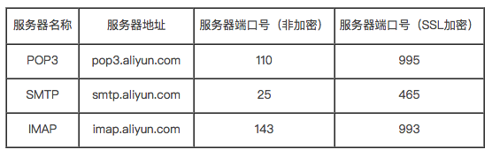
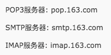

# ❖ Linux下「发送」邮件的命令行应用

> 发送邮件有超多种方法，但是接收邮件就要麻烦很多。所以这里先只讲发送邮件

先说明下：不管是什么邮件客户端，都是可以直接发邮件的。但是，因为默认的话，发件人是很随便地设置成你本机地名字。并且**100%**会被邮箱当成垃圾邮件处理。如果你去垃圾箱里找，还是可以看到的。这就是为什么，我们还是需要配置它，让它登录某个邮箱来使用它的身份发邮件了，比如gmail邮箱或阿里云邮箱。（国内的163和qq邮箱都已经屏蔽第三方客户端登录了）

> 另注：为什么如今这么电子技术这么发达的年代，命令行邮件终端相关的应用和文章还这么少几乎都是很多年前的？我想是因为：python等都已经能很好很方便支持发邮件了，没必要折腾命令行版本。
事实上，试过就知道：为什么这些客户端会被抛弃了。。。请看下面我入的坑：

## 「Mail」和「Sendmail」

> 注：Mail的配置相当麻烦，网上找文章也寥寥无几，有也都是十几年前的东西。所以建议放弃，使用更先进的客户端。

## 「Mutt」
> Mutt是Linux邮箱客户端榜上有名的利器了。

注意：这里不介绍Mutt作为邮件客户端的界面操作，而是直接作为命令行的命令来操作。

> 为什么?因为我们用命令行的邮箱客户端都是用来自动化的，一般来说不太需要终端的邮箱界面。

[参考：Linux使用mutt发送邮件](http://blog.51cto.com/wzlinux/2043647)

### 安装

其中`mutt`是软件本身，`msmtp`是用来帮助发件的工具。
```shell
# Linux
$ sudo apt-get install mutt msmtp

# 或Mac
$ brew install mutt msmtp
```

### 配置
你需要配置两个文件，一个是`~/.muttrc`用来配置Mutt本身，一个是`~/.msmtprc`用来配置发件人的，需要写入密码一类的。

[参考：Linux下使用mutt,msmtp发信](http://coolnull.com/82.html)

配置`~/.msmtprc`:
```shell
account     Aliyun
host        smtp.aliyun.com
from        jason@aliyun.com
auth        login
user        jason@aliyun.com
password    abcde123123123
account default : Aliyun
logfile ~/.msmtp.log
```
然后必须修改`~/.msmtprc`文件的权限，否则程序无法读取，发邮件时会报错。修改如下：
```shell
chmod 600 ~/.msmtprc
```

配置`~/.muttrc`：
```shell
set sendmail="/usr/bin/msmtp"
set use_from=yes
set realname="Jason"
set from="Jason@aliyun.com"
set envelope_from=yes
set editor="vim -nw"
```
注意：第一条`set sendmail`中的位置不一定是这样的，在Mac和Linux上都会不同，所以需要用`which msmtp`来找到它的真实位置，再填进去。

关于配置的解释可以看这里：



### 发送邮件命令格式

注意：收件人的地址前一定要明确指定参数名`--`，如下所示。否则无法正确发送附件。

```shell
# 常用格式如下 -s   “标题”  -c    抄送  -a  附件
$ echo “HELLO WORLD” | mutt -s “TITLE” -- RECIPIENT@gmail.com

# 发送HTML格式漂亮的邮件
$ mutt -- RECIPIENT@gmail.com -e 'set content_type="text/html"' -s "TITLE" < out.html

# 发送给多人，抄送，添加附件
$ echo "hello" | mutt -s "TITLE" aaa@gmail.com, bbb@gmail.com -c ccc@gmail.com -a /home/pi/pic.jpg address="RECIPIENT@gmail.com"

# 发送邮件时设置邮件的文本类型为：html格式，邮件的等级为:重要
$ echo $content | mutt  -s "${subject}" -e 'set content_type="text/html"' -e 'send-hook . "my_hdr  X-Priority: 1"' $address
```

语法：


参数：



### Mutt发送HTML漂亮富文本邮件

默认语法是：
```shell
$ mutt -- RECIPIENT@gmail.com -e 'set content_type="text/html"' -s "TITLE" < out.html
```
但是，值得注意的是，语法虽然简单，可一旦你本机的`mutt`版本不对，邮件将无法显示出正确的格式，而只是无尽的html源代码。
通过`mutt -v`可以看到，发送出显示正常的邮件的mutt版本是在树莓派上安装的`Mutt 1.5.23 (2014-03-12)`。而不成功的是在Mac上的`Mutt 1.9.5 (2018-04-13)`，反而是最新的版本！


## 邮箱配置

- [阿里云邮箱](https://help.aliyun.com/knowledge_detail/36576.html)

- 163邮箱

- 新浪邮箱
```
- 新浪@sina.com邮箱，
接收服务器地址为：pop.sina.com或pop3.sina.com，
发送服务器地址为：smtp.sina.com

- 新浪@sina.cn邮箱，
接收服务器地址为：pop.sina.cn或pop3.sina.cn，
发送服务器地址为：smtp.sina.cn

- 端口号设置：
POP协议：pop端口：110、smtp端口：25 
IMAP协议：IMAP 端口：143、smtp端口：25

- 加密设置：
pop是995、imap的是993
smtp是587或465，如465不能正常使用，
可以更换587试试，但不同的国家有可能只支持
一个端口(并非所有客户端都支持加密码) 。
```

- Outlook邮箱：
```
- POP
Server name: outlook.office365.com
Port: 995
Encryption method: TLS

- IMAP
Server name: outlook.office365.com
Port: 993
Encryption method: TLS

- SMTP
Server name: smtp.office365.com
Port: 587
Encryption method: STARTTLS
```

