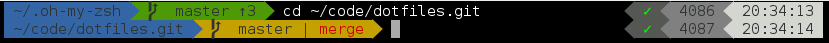
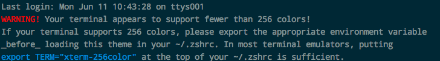
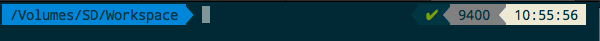
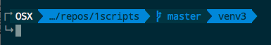
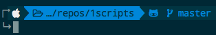

# ZSH安装超酷的powerlevel9k主题

网上看到别人的命令行右面竟然有个漂亮的时间戳，非常好奇。搜了下发现竟然是zsh的主题，叫`powerlevel9k`。



参考Github官方文档：https://github.com/bhilburn/powerlevel9k

## 安装
有了Oh my zsh的话就安装非常简单，
如下两步：
- 下载主题
```sh
$ git clone https://github.com/bhilburn/powerlevel9k.git ~/.oh-my-zsh/custom/themes/powerlevel9k
```
- 在`~/.zshrc`的首行处引入主题（真的需要写在首行才能保证不出问题，所有主题都一样）：
```vim
ZSH_THEME="powerlevel9k/powerlevel9k"
```

## 色彩问题
安装后有可能会提示你的终端色彩不够256色问题，


可以找它建议的，直接在`~/.zshrc`中强制指定终端色彩来解决：
```vim
export TERM="xterm-256color"
```



## 常用配置

默认配置参考官方说明：https://github.com/bhilburn/powerlevel9k/wiki/Stylizing-Your-Prompt
官方推荐的各种用户配置（带各种截图）：https://github.com/bhilburn/powerlevel9k/wiki/Show-Off-Your-Config

```vim
# ==== Theme Settings ====
# PowerLevel9k
# 左侧栏目显示的要素（指定的关键字参考官网）
POWERLEVEL9K_LEFT_PROMPT_ELEMENTS=(os_icon context dir vcs)
# 右侧栏目显示的要素
POWERLEVEL9K_RIGHT_PROMPT_ELEMENTS=(status root_indicator background_jobs time virtualenv)
#新起一行显示命令 (推荐！极其方便）
POWERLEVEL9K_PROMPT_ON_NEWLINE=true
#右侧状态栏与命令在同一行
POWERLEVEL9K_RPROMPT_ON_NEWLINE=true
#缩短目录层级
POWERLEVEL9K_SHORTEN_DIR_LENGTH=1
#缩短目录策略：隐藏上层目录中间的字
#POWERLEVEL9K_SHORTEN_STRATEGY="truncate_middle"
#添加连接上下连接箭头更方便查看
POWERLEVEL9K_MULTILINE_FIRST_PROMPT_PREFIX="↱"
POWERLEVEL9K_MULTILINE_LAST_PROMPT_PREFIX="↳ "
# 新的命令与上面的命令隔开一行
#POWERLEVEL9K_PROMPT_ADD_NEWLINE=true
# Git仓库状态的色彩指定
POWERLEVEL9K_VCS_CLEAN_FOREGROUND='blue'
POWERLEVEL9K_VCS_CLEAN_BACKGROUND='black'
POWERLEVEL9K_VCS_UNTRACKED_FOREGROUND='yellow'
POWERLEVEL9K_VCS_UNTRACKED_BACKGROUND='black'
POWERLEVEL9K_VCS_MODIFIED_FOREGROUND='red'
POWERLEVEL9K_VCS_MODIFIED_BACKGROUND='black'
```

## Python的Virtualenv和Pipenv虚拟环境显示问题
一般命令行里，进入虚拟环境的shell时会显示如`(venv) ~$ `这样的。
但是安装这个主题后，默认是没有的。
你必须手动设置添加才行。

方法是：
在`POWERLEVEL9K_LEFT_PROMPT_ELEMENTS`或者`POWERLEVEL9K_RIGHT_PROMPT_ELEMENTS`中添加`virtualenv`要素，就能够显示了。
如：
```vim
POWERLEVEL9K_LEFT_PROMPT_ELEMENTS=(os_icon context dir vcs virtualenv)
```



但是也有不能正常显示的时候，而且还会报错：
```sh
$ pipenv shell
Shell for UNKNOWN_VIRTUAL_ENVIRONMENT already activated.
No action taken to avoid nested environments.
```
这个不是主题的问题，测试后发现换了主题还是这样显示，所以这是ZSH的问题。
找了半天都没有结果怎么解决。
结果发现，不需任何修改，

只要关闭当前的终端窗口，重新打开就好了。


## 显示主机型号图标问题
像这种显示当前主机（如Mac）图标和Git图标的问题，是需要字体支持的。



默认是不开启的，必须要在`~/.zshrc`中指定使用这种方式显示：

```vim
#字体设定 (注意，字体设定必须放在主题之前）
POWERLEVEL9K_MODE='nerdfont-complete'
#主题设定
ZSH_THEME="powerlevel9k/powerlevel9k"
```

上面的字体模式可选的有：
- `nerdfont-complete`
- `awesome-fontconfig`
- `awesome-patched`

根据你的情况来尝试，因为不是每个都能完美无乱码显示出来。
