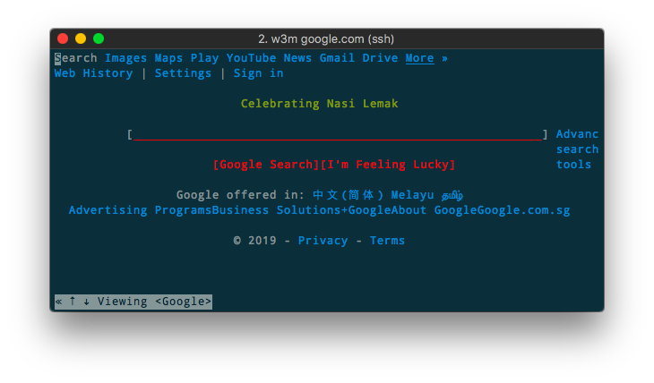

# W3M：超酷的命令行浏览器！ [DRAFT]

超酷不是说这个网页浏览器显示效果多酷，而是在命令行终端里浏览网页这件事非常酷！

试想一下：
你可以SSH进远程的服务器，任意浏览服务器“所在地”的网页，而不用建立任何隧道，这是什么体验？

当然，既然是命令行里的，也不要对排版有太大期待。可以说，所有的CSS和JS都是失效的，只是简化版的HTML展示。
但一些常用的功能如填写表格，搜索，链接跳转等，都还是能轻松实现的。


Mac安装：
```sh
$ brew install w3m
```

Ubuntu安装：
```sh
$ sudo apt-get install w3m
```

安装包才2M+，轻量到让我惊讶的地步。

浏览某个网页的方法：
```sh
$ w3m google.com
```




默认的情况下，是不会展示网页中图片和视频的，需要我们额外进行配置。


## 基本操作

[参考：文本浏览器w3m](http://blog.51cto.com/wesoho/201320)


## 浏览网页图片


## 修改浏览器属性

有时候我们访问网页，不想让网站知道我们是在用w3m浏览器，而是想让人知道我用的是Chrome浏览器。那么就需要修改`User-Agent`。

修改方法是在`~/.w3m/config`文件中，找到`user_agent`处，加入自己想要的agent，如：
```
user_agent Mozilla/5.0 (Macintosh; Intel Mac OS X 10_12_6) AppleWebKit/537.36 (KHTML, like Gecko) Chrome/72.0.3626.109 Safari/537.36
```

然后用`w3m https://www.whatsmyua.info/`命令打开网页，看看自己的User-Agent是不是改了呢。
