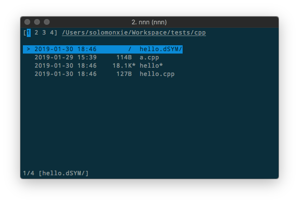

# ❖ `nnn` 真正极简主义的命令行文件管理器 [DRAFT]

[参考官方：jarun/nnn](https://github.com/jarun/nnn)
[参考官方推荐的视频教程：Luke Smith - I'M GOING TO USE THE NNN FILE BROWSER!](https://www.youtube.com/watch?v=U2n5aGqou9E)



`nnn`相对`Ranger`来讲，界面真的是极简，速度也能感觉到明显提升：完全无卡顿。
`nnn`真正贴合了命令行里快速浏览文件夹的需求：稳准狠。
`nnn`的安装又简单又轻量(55K)，对各种OS的支持又多到发指。

> 奇怪的是：`nnn`是Python开发的，但是速度竟然快到这种程度，是很让人惊讶的。

常用安装：
Mac：`brew install nnn`
Ubuntu: `sudo apt-get install nnn`

安装好后直接输入`nnn`命令就进入一个小小的文件夹浏览界面了。也可以`nnn ~/myfolder`进入指定文件夹。

基本操作（类似vim）：
- `h`,`l`或`←`,`→`进行父级子级目录切换，非常快！
- `j`,`k`进行上下移动
- `/`筛选

文件的选择(类似平常用的Ctrl-c)：
- 单选：按`<Space>`选中某个文件或文件夹
- 多选：先按大写`Y`开启多选模式，然后按`<Space`选中多个文件。
- 查看已选：按小写`y`查看已选文件列表。

文件复制、移动、删除（在已选中文件前提下）：
- Copy: 按大写`P`粘贴该文件。
- Move: 按大写`V`移动该文件。
- Delete: 按大写`X`删除。

文件重命名：
- 重命名单个文件：`Ctrl-r`
- 重命名多个文件：需要安装`vidir`程序才能用。


列表排序：
- 按时间排序：按`t`
- 按文件或文件夹大小排序：按`s`
- 按文件大小排序：直接按`S`
- 按占用磁盘大小排序：按`Ctrl-J`

> 建议不要按照文件大小排序，否则每次进入目录前都会执行`du`命令计算所有子文件和文件夹才能进入。


## 编译安装方法

树莓派Raspbian18.04也不支持nnn，所以试着编译安装。

```sh
cd  /tmp
wget https://github.com/jarun/nnn/archive/v2.2.tar.gz
tar xzvf v2.2.tar.gz
cd nnn-*

sudo apt-get install pkg-config libncursesw5-dev libreadline6-dev -y
make
sudo mv ./nnn /usr/local/bin
```

因为程序极轻量，所以就在原地生成一个`nnn`单二进制文件，也就是全程序。
然后直接把`nnn`文件移动到本地自己喜欢到bin目录即可开始用了。
