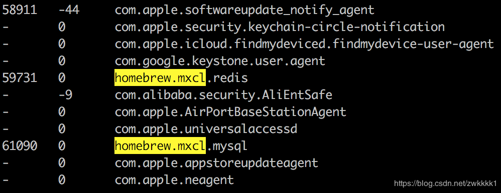

# Mac上用Homebrew管理服务(守护进程) [DRAFT]

Mac上的后台服务或守护进程和Linux上有很大不同，为了减少学习曲线，我们可以直接Homebrew帮忙轻松设置服务。

`brew services`一开始没有，但是第一次使用这个命令的时候，Homebrew就会自动下载安装。

常用命令：
- `brew services list` 显示Homebrew管理的所有服务
- `brew services start 程序名` 安装并启动某程序的服务
- `brew services run 程序名` 只是启动某程序的服务，但不会自动启动
- `brew services stop 程序名` 停止服务，也停止了自动启动
- `brew services restart 程序名` 重启服务

## 理解brew services

MacOS管理开机启动的服务，是采用系统内置的`launchctl`命令，Homebrew只是调用了这个程序，帮我们自动安装服务而已。但这也省去了不少自己配置服务的麻烦。

我们可以输入`launchctl list`命令，查看当前MacOS中已经安装的服务列表。
如果Homebrew已经帮我们安装了一些服务，那么运行这个列表，就会看到类似这种名称的服务：

[参考：使用 brew services 管理后台服务(MacOS)](https://blog.csdn.net/zwkkkk1/article/details/84832028)
[参考：brew services 原理解析，如何查看 brew services 列表？](https://newsn.net/say/mac-brew-services.html)

MacOS设置服务的方法，实际上是在`~/Library/LaunchAgents/`这个目录下放置一个一个的`*.plist`文件，每个plist，都是一个服务。而服务的具体配置如启动位置、启动顺序等，都是在这个XML格式的plist文件中配置。

如果不想了解手动的配置方法，就直接使用`brew services`即可。当然，前提是程序是用homebrew安装的，且程序支持`brew services`配置。如果不支持，那么只能自己手动做了。

手动的方法就是用launchctl程序指定plist文件位置控制，如`launchctl load 文件位置`来启动服务，用`launchctl unload 文件位置`来停止服务。

[参考：使用 Homebrew 管理 Mac 的后台服务.md](https://gist.github.com/wen-long/f86a4e3ba55ee2ebcd44)

## 安装常用的程序

常用程序有：
- MySQL
- Redis
