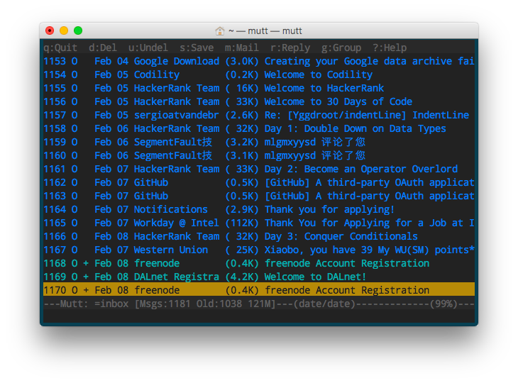
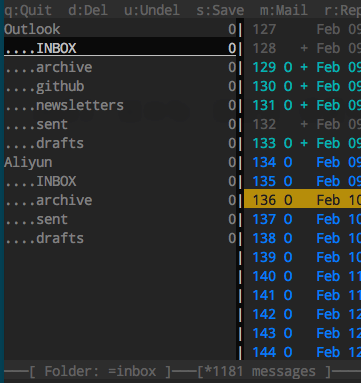
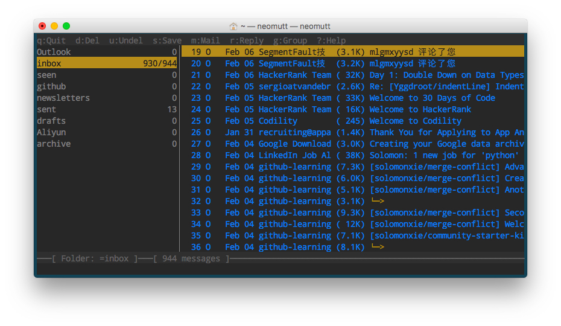

# Mutt美化指南 [DRAFT]


## Mutt配置主题

Mutt主题配置非常简单：下载主题文件，然后在`~/.muttrc`中`source /path/to/file`引用这个主题，完成！

例如，我们用著名的Gruvbox主题：https://github.com/altercation/mutt-colors-solarized

下载各种文件后，挑一个dark或light主题，比如`mutt-colors-solarized-dark-256.muttrc`，然后，比如我们放到`~/`目录下。然后编辑`~/.muttrc`，在里面加一句：
```
source ~/.mutt/mutt-colors-solarized-dark-256.muttrc
```
重新打开mutt即可看到效果。




## Sidebar 侧边栏设置

侧边栏可以在`~/.muttrc`中一句`set sidebar_visible = yes`就开启侧边栏。
但是，默认侧边栏是空的！必须要我们手动在muttrc中添加才行。

比如：
```
# Account Settings
mailboxes Personal \
          +jeff@jeffjewiss.com/INBOX \
          +jeff@jeffjewiss.com/archive \
          +jeff@jeffjewiss.com/github \
          +jeff@jeffjewiss.com/newsletters \
          +jeff@jeffjewiss.com/sent \
          +jeff@jeffjewiss.com/drafts \
          Gmail \
          +jeffjewiss@gmail.com/INBOX \
          +jeffjewiss@gmail.com/archive \
          +jeffjewiss@gmail.com/sent \
          +jeffjewiss@gmail.com/drafts \
          Work \
          +jeff@tallarium.com/INBOX \
          +jeff@tallarium.com/archive \
          +jeff@tallarium.com/sent \
          +jeff@tallarium.com/drafts \
```

然后就会显示出类似这种效果：




### 侧边栏的操作：
这个没有默认的快捷键，需要自己手动设置才能有。

示例：
```
    bind index,pager <up> sidebar-prev
    bind index,pager <down> sidebar-next
    bind index,pager <right> sidebar-open

    # Use 'B' to switch the Sidebar on and off
    bind index,pager B sidebar-toggle-visible
```
这样设置的话，`Up/Down`用来上下选择侧边栏的文件夹，`Right`键进入选中的文件夹。`B`用来开关侧边栏。


## 邮件列表美化

列表的排序，默认是`从旧到新`，但是一般我们习惯`从新到旧`。所以我们在muttrc中设置如下：
```
    set sort=threads
    set sort_browser=date
    set sort_aux=reverse-last-date-received
```

效果如下：



