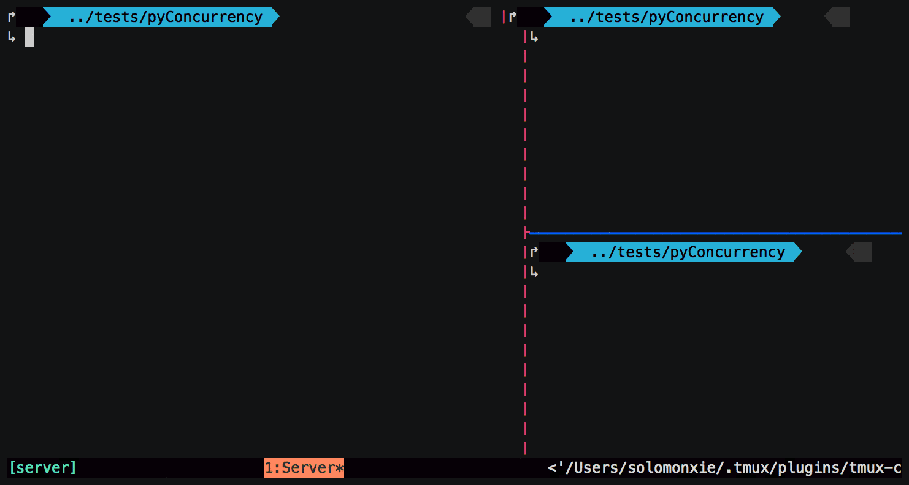
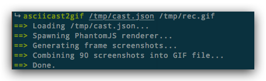
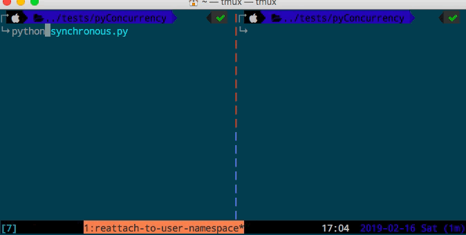
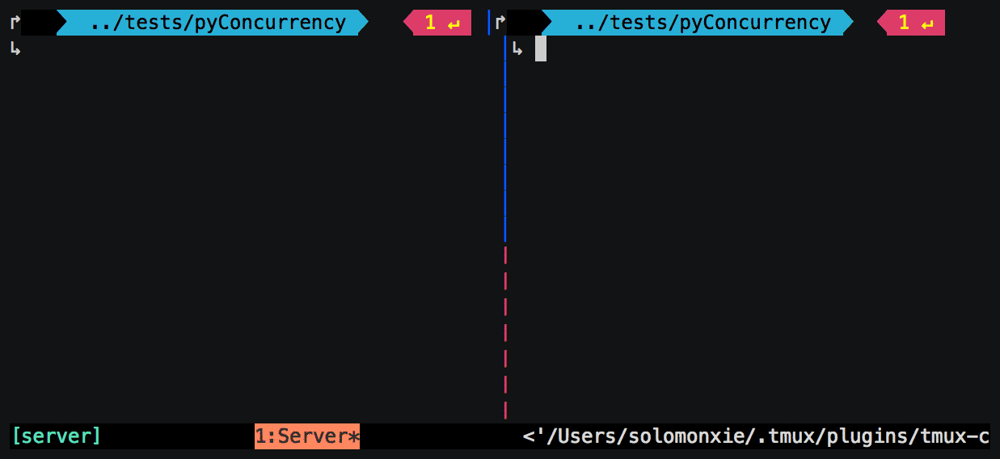

# ❖ 终端录屏程序`asciinema`

对于经常要写开发教程和攻略来说，GIF动图能增强不少说明力。问题是，录制视频再转GIF太麻烦，直接用一些GIF录屏也躲不过图片体积太大：动辄好几MB这一关。
所以这时候我们就要让流行的`asciinema`命令上场了。它能轻松录制你在终端里的所有操作，把所有动作保存为JSON文档，而不是真的录制视频，所以文件都极其小。要播放的话可以直接用它的命令播放。要转换GIF的话有相关的转换器，转换后体积都不会比直接录制屏幕大。




Mac安装：
```sh
$ brew install asciinema
```

Pip安装：
```sh
$ pip install asciinema
```

录屏：
```sh
$ asciinema rec <output-file-name>
```
其中可以指定输出文件的名字，扩展名可以是`*.json`,`*.cast`都行，随意。
本质上文件是一个JSON格式的数据集，记录了每个步骤细节。如果不指定文件名也可以，程序会自动生成一个文件，并显示输出的文件路径。
所以，程序制成的格式是不能用视频播放器或GIF播放器播放的，只能用asciinema程序播放。

播放：
```sh
$ asciinema play </path/to/file>
```
按`Ctrl-c`退出播放。


附加/覆盖：
```sh
# 在已经录制的文件后附加录制内容：
$ asciinema rec <output-file-name> --append

# 覆盖已经录制的文件
$ asciinema rec <output-file-name> --overwrite
```


### 对Tmux录屏

对一个Tmux录屏，需要先退出tmux，然后通过asciinema进入tmux的指定session进行录制。
如下：
```sh
$ asciinema rec --command "tmux attach -t session-name"
```
录制结束后，不要直接Ctrl-D退出，而是先`prefix-d`退出Tmux，再`Ctrl-c`结束录制。


### asciinema转换为GIF图片

有时候我们需要把录屏结果显示到网页上，那么就需要转换为GIF图片了。
asciinema程序自身没有转换功能，但是官方开发了一个NodeJS版本的程序用来转换：
[参考：asciinema/asciicast2gif](https://github.com/asciinema/asciicast2gif)

前提是本机已经安装：`NodeJS`，`ImageMagick`和`giflossy` (或`gifsicle`)。

Mac安装过程：
```sh
brew install ImageMagick gifsicle node
npm install --global asciicast2gif
```

转换：
```sh
$ asciicast2gif </path/to/INPUT.json> </path/to/OUTPUT.gif>
```

如：



转换过程很慢，但是文件非常小，远比自己直接录屏要小很多。
比如下面的GIF，直接视频录屏转GIF的文件是7M左右，通过减少帧率和显示效果文件在1M左右，而用asciinema转换为GIF超清晰原画，只有237Kb。可见一斑。







有时候如果文件比较大，可以选择在转换前选择降低显示效果。
`asciicast2gif`降低效果的方法是设置Environment Variable环境变量`GIFSICLE_OPTS`。比如：

```
$ export GIFSICLE_OPTS="-k 16 -O3"
$ asciicast2gif </path/to/INPUT.json> </path/to/OUTPUT.gif>

# or
GIFSICLE_OPTS="-k 16 -O3" asciicast2gif </path/to/INPUT.json> </path/to/OUTPUT.gif>
```


