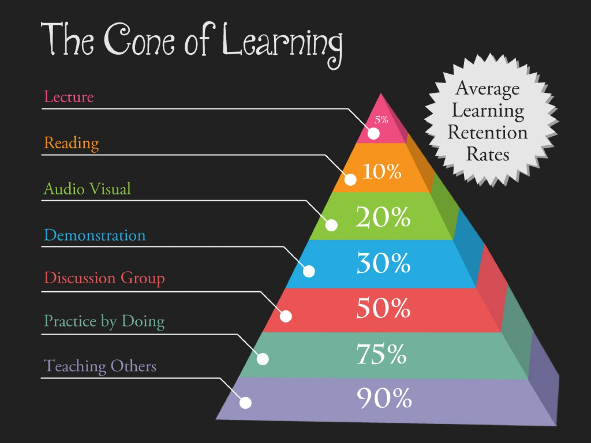

# Prerequisites

> By having a wild thought on start a career on Artificial intelligence, started today to do a tiny research on how to study AI. It turns out it consist of a shit black hole of knowledges, which means I have to study all of those things, not mention even some basic terms are causing a headache to me, such like Machine Learning, Deep Learning, Data Mining, Big Data, Classification etc etc. Thus I tend to write down some notes and random thoughts here helping me to organise it better. Saying, a tiny pen is better than a great brain.

## Prerequisites
### Math

- [x] Linear Algebra (Finished Basics)
PCA, SVD, Eigen Decomposition, LU Decomposition, QR Decomposition, Norms, Projection, Symmetric Matrix, Orthogonal Matrix, Matrix Operations, Vector Space, 
- [ ] Differential Calculus
- [ ] Integral Calculus
- [ ] Multivariable Calculus
微分和积分、偏微分、向量值函数、方向梯度、海森、雅可比、拉普拉斯、拉格朗日分布
- [ ] Statistics & Probability
组合、概率规则和公理、贝叶斯定理、随机变量、方差和期望、条件和联合分布、标准分布（伯努利、二项式、多项式、均匀和高斯）、 矩母函数 （Moment Generating Functions）、最大似然估计（MLE）、先验和后验、最大后验估计（MAP）和抽样方法。

### Computer Science
- [ ] Data Structures
- [ ] Algorithm & Optimization
这对理解我们的机器学习算法的计算效率和可扩展性以及利用我们的数据集中稀疏性很重要。需要的知识有数据结构（二叉树、散列、堆、栈等）、动态规划、随机和子线性算法、图论、梯度/随机下降和原始对偶方法。

### Programming (Python)
- [x] Jupyter Notebook
- [ ] matplotlib
- [ ] Numpy
- [ ] scikit-learn
- [ ] pandas

