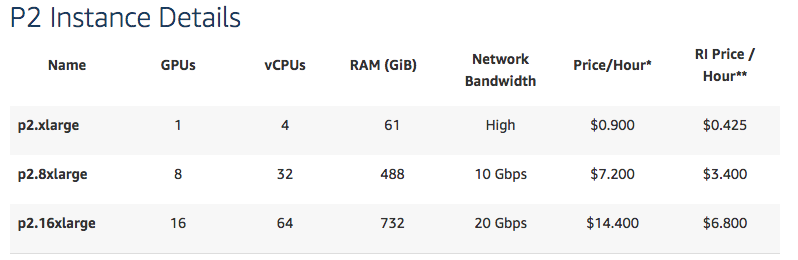

# Hardwares for Deep Learning

## Commands
- Check OS: `cat /etc/os-release`
- Check Storage: `df -h`
- Check CPU: `cat /proc/cpuinfo`
- Check RAM: `cat /proc/meminfo`
- Check GPU: 
```
$ sudo apt-get install nvidia-smi
$ nvidia-smi -stats
```


## Google Colab (Jupyter Notebook)

Link: https://colab.research.google.com/notebooks/welcome.ipynb

- OS: Ubuntu 17.10 Artful Aardvark
- GPU: (12hrs) NVIDIA Tesla K80 GPU × 1
- CPU: Intel(R) Xeon(R) CPU @ 2.30GHz × 1 Core
- RAM: 13GB
- Disk: 40GB


## Kaggle Kernel (Jupyter Notebook)

[Refer to Kaggle: How to use Kaggle - Kenels](https://www.kaggle.com/docs/kernels)
Link: https://www.kaggle.com/kernels

- OS: Debian GNU/Linux 8 (jessie)
- GPU: (Queue needed) NVidia Tesla K80 GPU × 1
- CPU: Intel(R) Xeon(R) CPU @ 2.30GHz × 2 Cores
- RAM: 25.5GB
- Disk: 5.2GB


## Azure Notebooks (Jupyter Notebook)

Link: https://notebooks.azure.com/Microsoft/libraries/samples

- OS: Ubuntu 16.04.5 LTS
- GPU: N/A
- CPU: Intel(R) Xeon(R) CPU E5-2673 v4 @ 2.30GHz × 2 Cores
- RAM: 4GB
- Disk: 20GB


## AWS p2

[Refer to AWS: Amazon EC2 P2 Instances](https://aws.amazon.com/ec2/instance-types/p2/)

- GPU: NVIDIA Tesla K80 GPU × (1 to 16)
- CPU: Intel Xeon® E5-2686 v4 × (4 to 64)
- RAM: 61G or 488G or 732G 

> P2 instances provide up to 16 **NVIDIA K80 GPUs**, 64 vCPUs and 732 GiB of host memory, with a combined 192 GB of GPU memory, 40 thousand parallel processing cores, 70 teraflops of single precision floating point performance, and over 23 teraflops of double precision floating point performance. 
P2 instances also offer GPUDirect™ (peer-to-peer GPU communication) capabilities for up to 16 GPUs, so that multiple GPUs can work together within a single host.





## DIY

### GPU
- [`NVIDIA Tesla K80 GPU`](https://www.amazon.com/Nvidia-Tesla-GDDR5-Cores-Graphic/dp/B00Q7O7PQA): RMB 30,000, VRAM 24GB (GDDR5), 256 Bit

### CPU
- [`Intel Xeon® E5-2686 v4`](https://www.ebay.com/itm/Intel-Xeon-E5-2686-v4-SR2K8-2-30GHz-18-Core-LGA2011-3/323405561085?epid=20005107689&hash=item4b4c793cfd%3Ag%3A6cQAAOSwlQ5baCxE&LH_ItemCondition=3): RMB 12,000, 8 Cores, 1.7GHz
