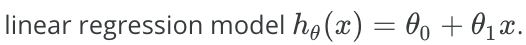
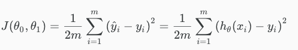
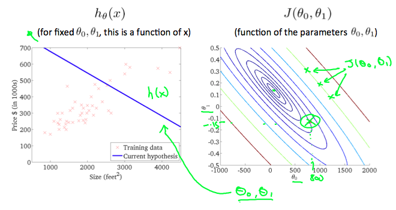
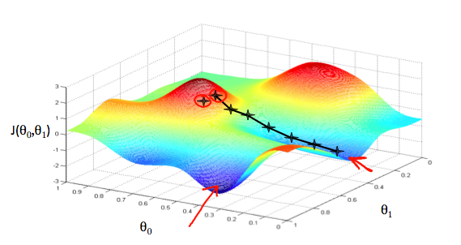
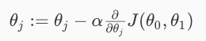
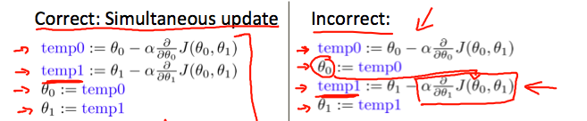

# Notes on Coursera ML Andrew Ng

In general, any machine learning problem can be assigned to one of two broad classifications:
Supervised learning and Unsupervised learning.

> Tom Mitchell provides a more modern definition: "A computer program is said to learn from experience E with respect to some class of tasks T and performance measure P, if its performance at tasks in T, as measured by P, improves with experience E."

### Supervised learning: "Right answers" given.
- It can be a **Regression problem**, which `predict continuous valued output`,
- also can be a **Classification** problem, which `predict discrete valued output`.

### Unsupervised learning: 
is to find out some **structure** in a dataset, and find out **clusters** is a big part of the work. 
**With unsupervised learning there is NO feedback based on the prediction results.**

### There's also _Non-clustering_ problem for unsupervised learning
like the "cocktail party algorithm".

### _Octave_ 
Octave is much more faster to implement a prototype than other languages. We can first use Octave to test our ideas, models, and transfer it into other languages when it's success.

### Linear regression model

### Cost function

### Contour Plot

### Gradient Descent intuition

### Gradient descent algorithm
The gradient descent algorithm is: **repeat until convergence:**

where `j=0,1` represents the feature index number.

simultaneously update the parameters θ1, θ2...

### "Batch" Gradient descent
**"Batch": Each step of gradient descent computes ALL the training data.**
