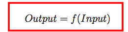
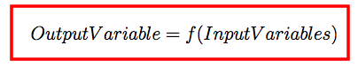
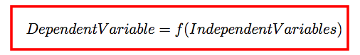

# Variables

> "The statistical perspective frames data in the context of a hypothetical function (f) that the machine learning algorithm is trying to learn. That is, given some input variables (input), what is the predicted output variable (output)."

