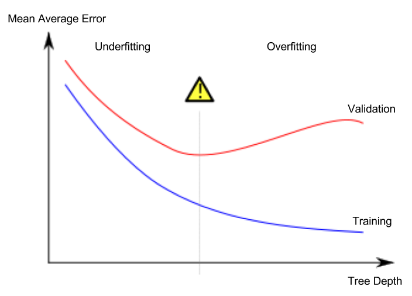

# Build Simple Model for ML (Decision Tree)

## Steps of building a model

[Refer to Kaggle: Your First Machine Learning Model
](https://www.kaggle.com/dansbecker/your-first-machine-learning-model)

The steps to building and using a model are:
- **Define:** What type of model will it be?  A decision tree?  Some other type of model? Some other parameters of the model type are specified too.
- **Fit:** Capture patterns from provided data. This is the heart of modeling.
- **Predict:** Just what it sounds like
- **Evaluate**: Determine how accurate the model's predictions are.

## Underfitting and Overfitting

[Refer to Kaggle: Underfitting and Overfitting](https://www.kaggle.com/dansbecker/underfitting-and-overfitting)

- Overfitting: The model matches the **training data** almost perfectly, but does poorly in predicting **new data**.
- Underfitting: The model fails to capture important patterns & distinctions in the data, so it performs poorly even in **training data**.

As the `Decision Tree Model`'s depth goes deeper, the `Underfitting` goes lesser, but there is **"turn"** at which it starts `Overfitting` and the error goes larger.

For finding out the **"turning point"**, we need to test out some depths , namely the `max_leaf_nodes`. At which the error start to turn descending to ascending, we will choose that depth as the best depth for training data in Decision Tree Model.

