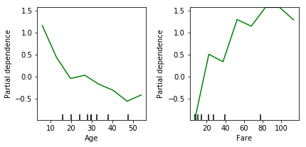

# Partial Dependence Plots
> Extract insights from your models. Insights many didn't even realize were possible.

[Refer to Kaggle: Partial Dependence Plots](https://www.kaggle.com/dansbecker/partial-dependence-plots)

Partial dependence plots are a great way (though not the only way) to extract insights from complex models. These can be incredibly powerful for communicating those insights to colleagues or non-technical users.
