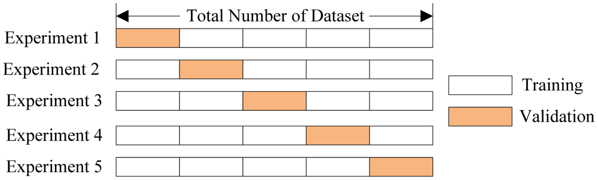

# Cross-Validation

[Refer to Kaggle: Cross-Validation](https://www.kaggle.com/dansbecker/cross-validation)

> On small datasets, the extra computational burden of running cross-validation isn't a big deal. These are also the problems where model quality scores would be least reliable with train-test split. So, if your dataset is smaller, you should run cross-validation.

