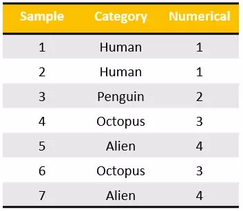
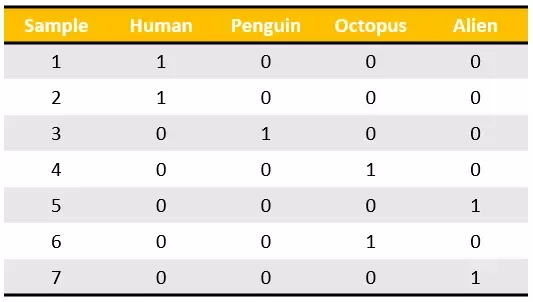
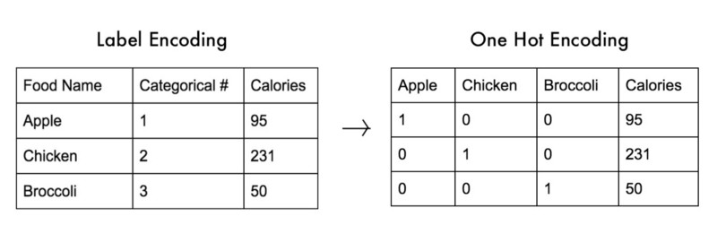

# One-hot Encoding

[Refer to Quora: What is one-hot encoding and when is it used in data science?](https://www.quora.com/What-is-one-hot-encoding-and-when-is-it-used-in-data-science)
[Refer to youtube: A demo of One Hot Encoding (TensorFlow Tip of the Week)](https://www.youtube.com/watch?v=BecEHOVmx9o)

> "Encoding" is to take a number to represent a categorical value. 

`Lable encoding`:

But the problem is, those values would rather be **nominal values** instead of **ordinal values**, because we can't say one is greater or smaller than another.
And there it comes `One-hot encoding`, which we only take numbers `1 & 0` to represent the categorical value, but in a **TABLE**:

Note that, the the result of encoding will be as a **VECTOR**.

> In this case, the value for _sample-1_ is encoded to a **vector** `[1,0,0,0]`, and value of _sample-5_ is encoded to **vector** `[0,0,0,1]`.

