# Book: Intro to Statistical Learning (ISL)

## Model selection: 「Prediction」 vs. 「Inference」

- If our goal is to **understand** the data, namely the `inference`, then it's better to choose the model with more **interpretability**.
- if our goal is to **predict**, then it's good to go with models that have more **flexibility** but less understandable, sometime it may refer to "non-linear" models.

## Model selection: 「Flexibility」 vs. 「Interpretability」

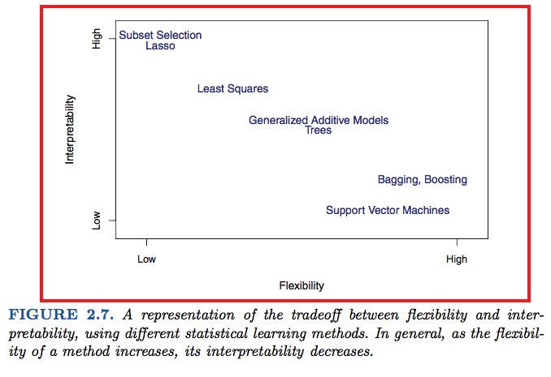

## 「Clustering」

`Cluster Analysis` is NOT to compare `input and output(x & y)`, but to compare `two variables (x1 & x2)`,
because in the case there's no clear associate for `x & y`, we have left no choice but to analyze variables themselves.

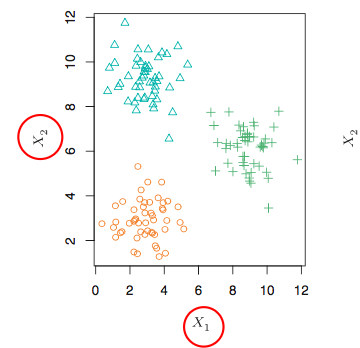

## Model selection: 「Quantitative」 vs. 「Qualitative」

- Numerical: Linear Regression
- Categorical: Logistic Regression, boosting, KNN

## Model selection: 「Train MAE」 vs. 「Test MAE」

> In general, we do not really care how well the method works training on the `Training data`.
Rather, we are interested in the accuracy of the predictions that we obtain when we apply our method to previously `Unseen Test data`.

**We’d like to select the model for which the average of this quantity—the `test MSE`—is as small as possible.**

> There is no guarantee that the method with the lowest training MSE will also have the lowest test MSE.

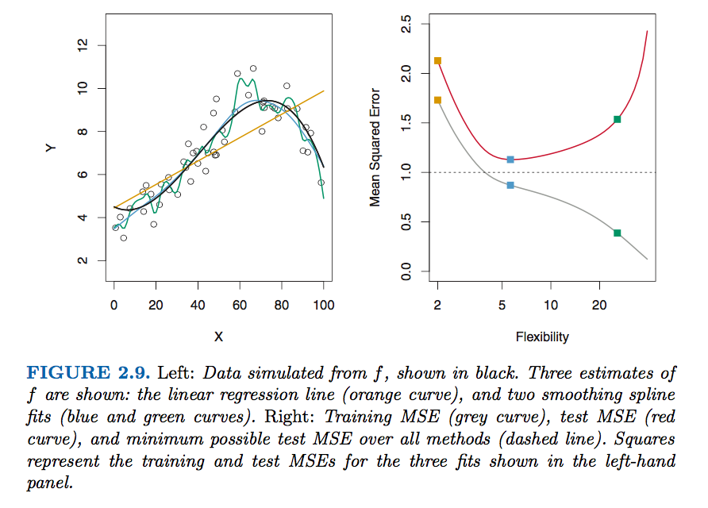

> Regardless of whether overfitting has occurred, we almost always want the `Training MSE` to be SMALLER than the `Test MSE`, 
because most statistical learning methods either directly or indirectly seek to **minimize** the training MSE. Overfitting refers specifically to the case in which a less flexible model would have yielded a smaller test MSE. 

## 「Bias-Variance」 Trade-off

The relationship between `bias`, `Variance` and `Test MSE`

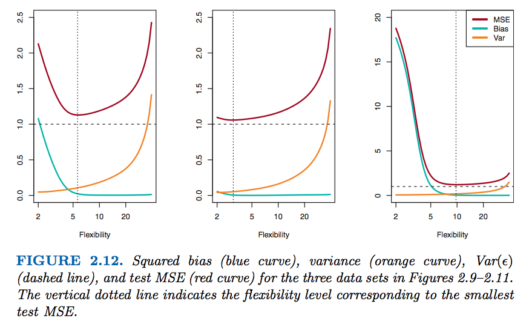

## Evaluate Classification: 「Training Error Rate」 vs. 「Test error」

Training Error Rate:
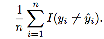

Test Error:
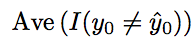

## 「Bayes Classifier」

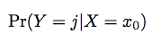

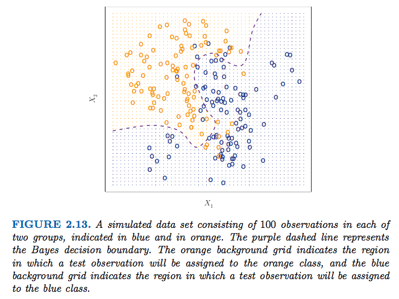

**`Bayes decision boundary`**: The Bayes classifier’s prediction is determined by the Bayes decision boundary; an observation that falls on the orange side of the boundary will be assigned to the orange class, and similarly an observation on the blue side of the boundary will be assigned to the blue class.

`Bayes Error Rate`: The Bayes classifier produces the lowest possible test error rate, called the Bayes error rate. 
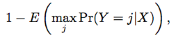

> Note that: In theory we would always like to predict qualitative responses using the `Bayes classifier`. But for real data, we do not know the conditional distribution of Y given X, and so computing the `Bayes classifier` is **impossible**. Therefore, the Bayes classifier serves as an **unattainable gold standard** against which to compare other methods.

## 「K-Nearest Neighbors」 (KNN Classifier)

> Many approaches attempt to estimate the conditional distribution of Y given X, and then classify a given observation to the class with highest estimated probability. One such method is the K-nearest neighbors (KNN) classifier.

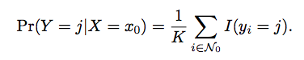

KNN applies `Bayes rule` and classifies the test observation x0 to the class with the largest probability.

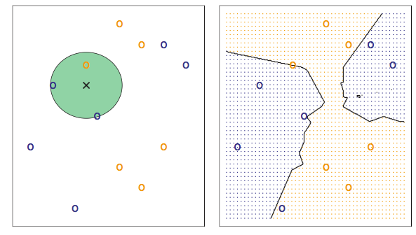
> In the left-hand panel, we have plotted a small training data set consisting of six blue and six orange observations. Our goal is to make a prediction for the point labeled by the black cross. Suppose that we choose K = 3. Then KNN will first identify the three observations that are closest to the cross. This neighborhood is shown as a circle. It consists of two blue points and one orange point, resulting in estimated probabilities of 2/3 for the blue class and 1/3 for the orange class. Hence KNN will predict that the black cross belongs to the blue class. In the right-hand panel of Figure 2.14 we have applied the KNN approach with K = 3 at all of the possible values for X1 and X2, and have drawn in the corresponding KNN decision boundary.

