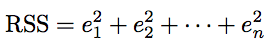
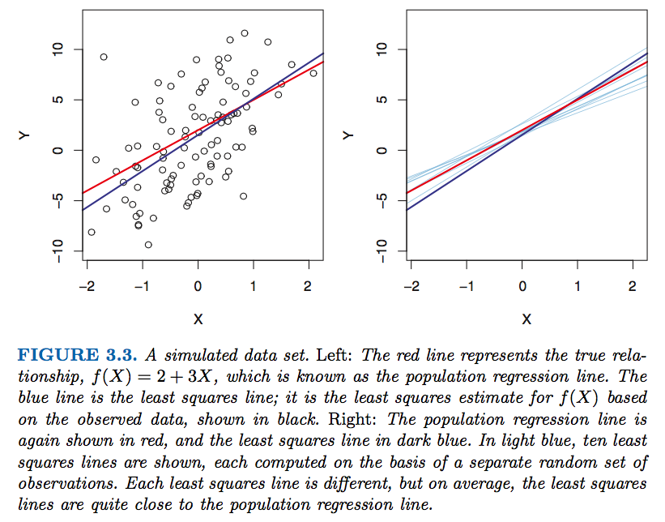
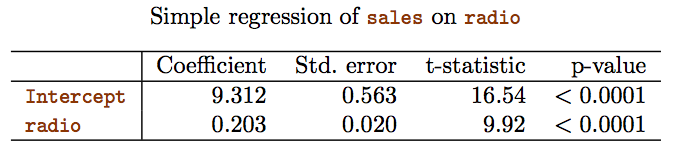

# Book: ISL chapter 3 Linear Regression

## 「Simple Linear Regression」 (SLR)

> which is to examine how ONE variable effect the result.

Linear Regression: Assume there is _linear relationship_ between x and y. so that's to be:

in which the intercept & slope are **unknown constants**.

For the two constants or **coefficients**, we need to estimate them from dataset, as close as it can be.

`Least squares` is the easiest way to describe the **closeness**

`Residual sum of squares (RSS)`:

## 「Multiple  Linear Regression」(MLR)

> Examine how multiple variables make a compact effect on the result.

