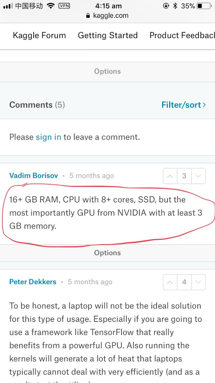
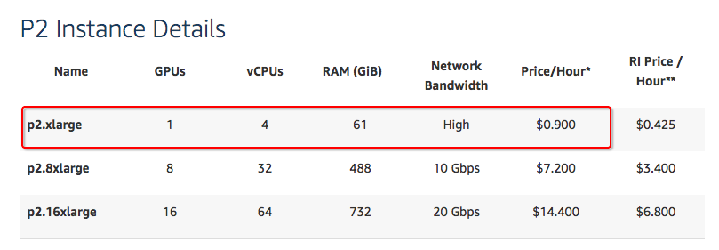
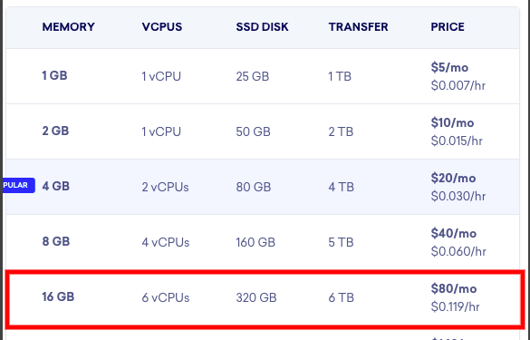
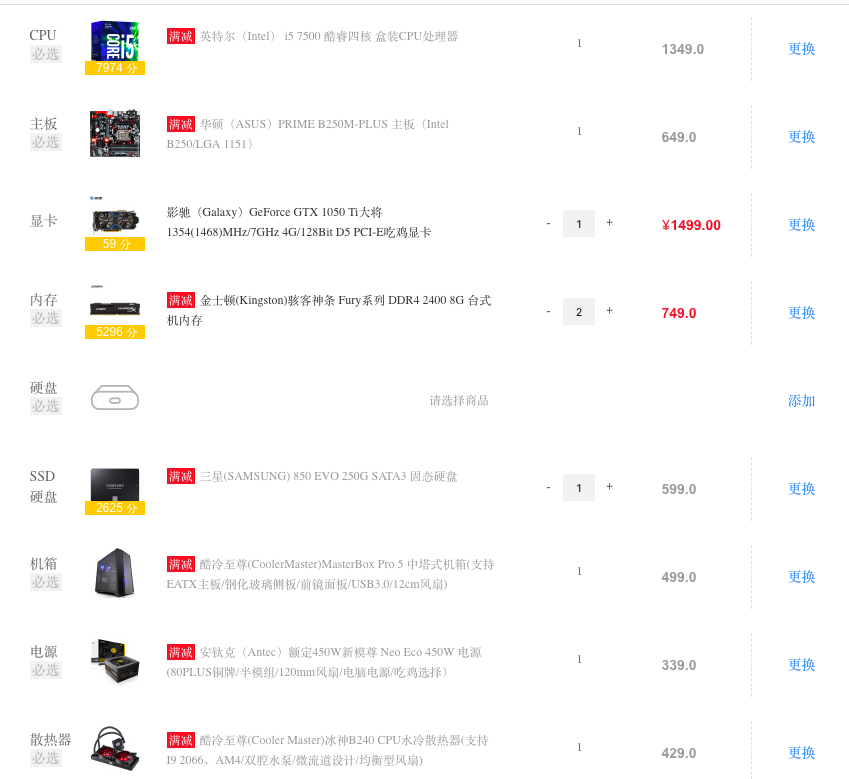

# Hardware for Kaggle competition

I was shocked when I saw the response to a question that the minimum PC specs for running kaggle competition:

## AWS EC2 p2 instance pricing

## DigitalOcean droplet pricing

## Buy a PC

