# Statistical Learning (OneNote) [DRAFT]

## Basics

### Learning Goal

> WE FIRST ASSUME THERE EXISTS AN ALMIGHTY FUNCTION Y=f(x) FOR EVERY (x, y)

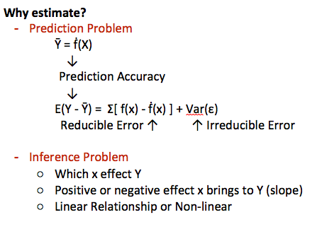

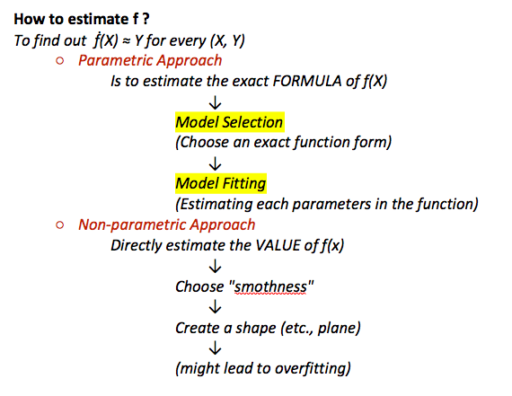

### Model Selection

- Interpretability
    - Interpretable (Easy to understand)
    - Predictable (More precise)
- Labeled
    - Supervised (With right answer, labeled)  -> For prediction problem
        - Quantitative -> Regression Models
        - Qualitative -> Classification Models
    - Unsupervised (Without right answer)  -> For clustering analysis
        - Neural Network
- Numeric
    - Regression (Quantitative/Numerical Variables)
        - Linear Regression
            - Simple Linear Regression (One variable)
            - Multiple Linear Regression (Multiple variables)
    - Classification (Qualitative/Categorical Variables)
        - Classifier
            - Logistic Regression
        - Bayes Classifier
        - KNN Classifier
- Accuracy (Bias-Variance Trade-off)
    - Regression settings
        - MSE
        - AVE
    - Classification settings
        - Classifier
        - Bayes Classifier
        - KNN Classifier

## Statistics

### Plots

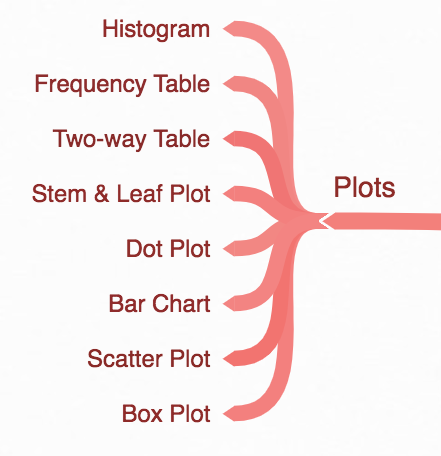

### Distribution

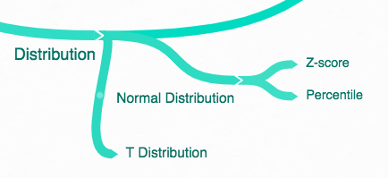

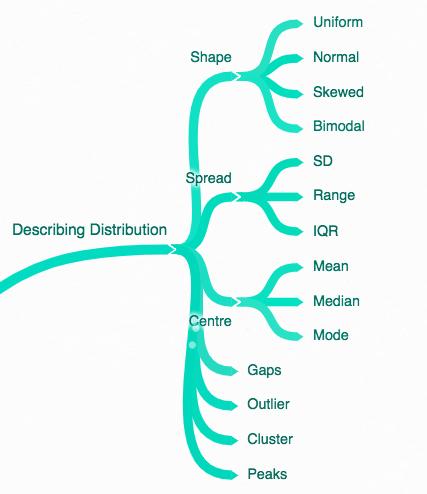

### Inferential Statistics

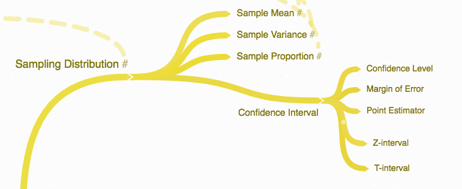

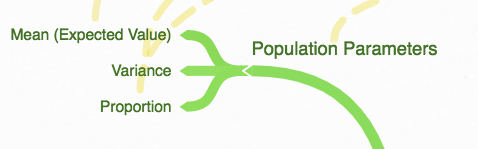

### Probability

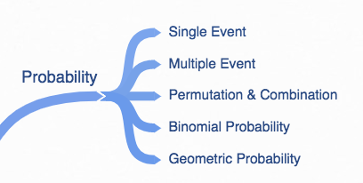

### Hypothesis Test [DRAFT]

### Random Variable

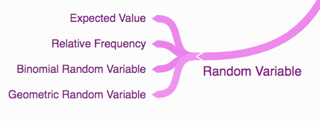

### Bayesian Theorem [DRAFT]

## Linear Regression

### Mo: Linear Regression

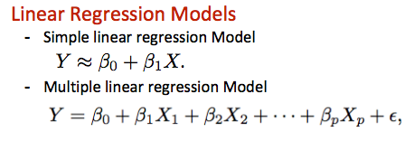

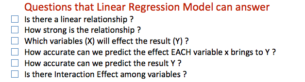

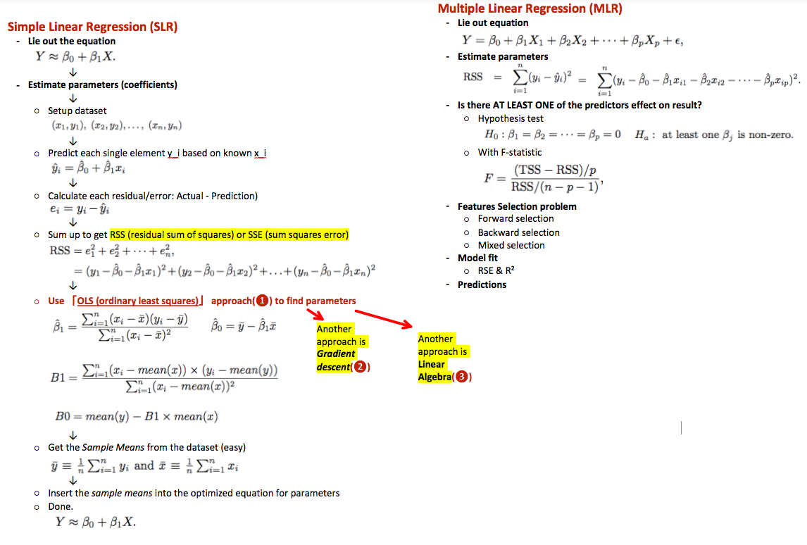

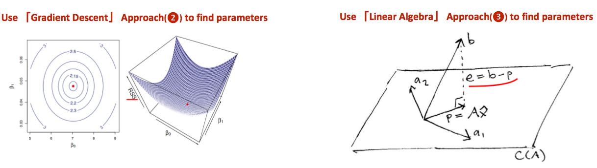

### Linear Least Squares

> Linear least squares is ONE WAY to estimate a Linear function by finding the minimum value of squared-residuals.

The logic is:
	- Since we assume it's a linear function, so the only UNKNOWNS are coefficients β1 & β0
	- Our mission is to guess the two values which produce the minimum value of summed squared-residuals
	
Main Formulations of Linear least squares
	- Ordinary Least Squares (OLS), unweighted
		○ Simple linear regression (SLR)
		○ Multiple linear regression (MLR)
	- Weighted Least Squares (WLS)
	- Generalized Least Squares (GLS) 
Alternative Formulations
	- Iteratively reweighted least squares (IRLS)
	- Instrumental variables regression (IVR)
	- Total least squares (TLS)

Numerical methods for linear least squares
	- Inverting the matrix of the normal equations
	- Orthogonal decomposition methods

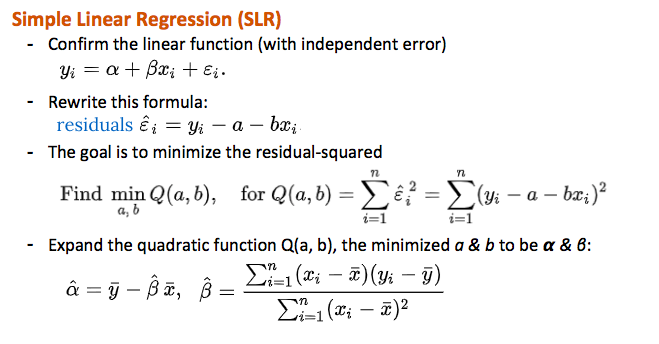

Regularized Linear Regression
Modified version of Ordinary linear regression, not only minimize cost function,
but also reduce complexity of the model.
	- Lasso Regression (L1 Regularization): minimize Absolute Sum of Coefficients
	- Ridge Regression (L2 Regularization): minimize Squared Absolute Sum of Coefficients

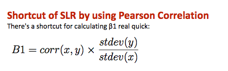

### Gradient Descent

Gradient Descent Methods
	- Batch Gradient Descent (BGD)  -> for small dataset
		○ Parameters β1/β0 start from 0
		○ Iterate from 0 and update parameters every time
		○ Stop until cost function cost(β1, β0) ≈ 0
	- Stochastic Gradient Descent (SGD) -> for large dataset
		○ Parameters β1/β0 start from a random number
		○ Random walk

Standard Procedures of Gradient Descent
	- Setup initial value of parameters β1 and β0
	- Form a cost function with β1, β0: cost(β1, β0)
	- Calculate derivative (slope) of cost function: delta = cost(..)'
	- Update parameters β1, β0 with improvement: β? = β? - (alpha * delta)
	- Next iteration with NEW parameters until cost(β1, β0) ≈ 0

Batch Gradient Descent (BGD) 
Calculating the derivative from all training data before calculating an update. 
	- Asdf
	- asdfas

Stochastic Gradient Descent (SGD) 
Calculating the derivative from each training data instance and calculating the update immediately. 
	- Asdfa
	- asfdsafd

### Model Accuracy

Bias-Variance Trade-Off
The prediction error for any machine learning algorithm can be broken down into three parts: 
	- Bias Error: error caused by choosing models on interpretability
		○ High-Bias models: Linear Regression, Logistic Regression …
		○ Low-Bias models: Decision Trees, KNN, SVM
	- Variance Error: error caused by choosing models on flexibility
	- Irreducible Error (ε): cannot be reduced regardless of what algorithm is used. 
		○ High-Variance models: Decision trees
		○ Low-Variance models: Linear Regression

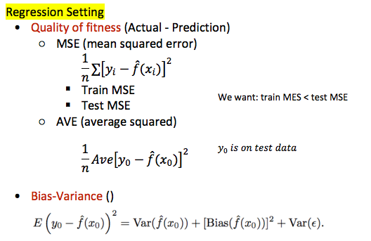

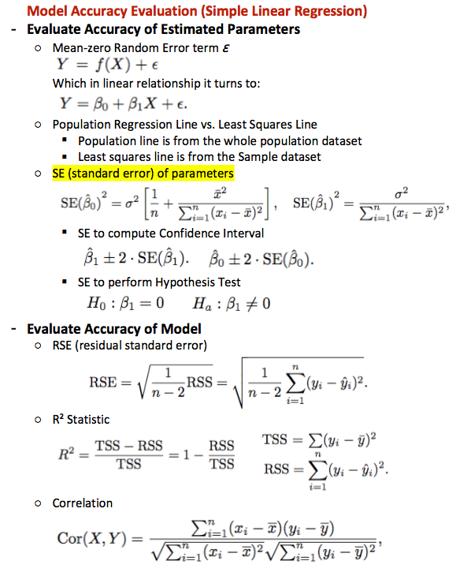

### Hypothesis Test for ML

Some examples of statistical hypothesis tests and their distributions from which critical values can be calculated are as follows:
• Z-Test: Gaussian distribution (Normal Distribution).
• Student t-Test: Student’s t-distribution.
• Chi-Squared Test: Chi-Squared (𝜲²) distribution.
• ANOVA: F-distribution (Fisher–Snedecor distribution).

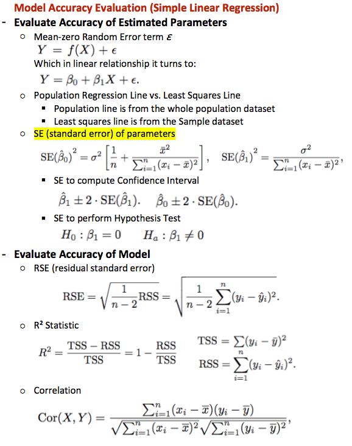

### Features Selection [DRAFT]

Features selection approaches
	- Stepwise Regression
		○ Forward selection
		○ Backward selection
		○ Bidirectional elmination
	- LASSO

❶ Stepwise Regression
Main approaches:
	- Forward Selection
	- Backward Selection
	- Bidirectional Elimination

❷ LASSO (least absolute shrinkage & selection operator)

## Classification

### Classification Basics

Encodings of Categories
	- Code with order/rank
	- Binary code: yes or no
	- One-hot Encoding

Why NOT Linear regression?
Because the probability must fall between 0 and 1,
but Linear regression is not sensible and may lead the
result below 0 or above 1.
To avoid that, we MUST model p(X) using a function gives
output between 0 and 1. 
Many functions meet this description, logistic function in 
Logistic Regression is one of them.

### Logistic Regression

> is to predict the probability of a categorical dependent variable, which is a binary variable

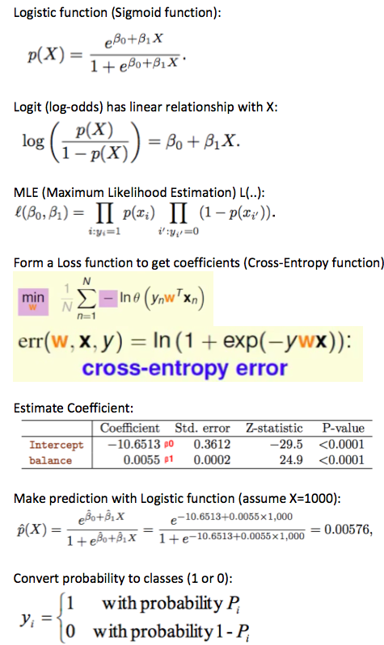

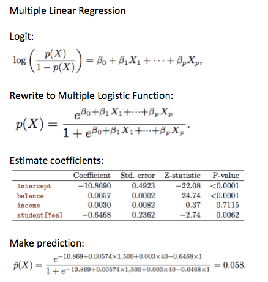

### Linear Discriminant Analysis

LDA (linear discriminant analysis) is an alternative
to Logistic regression for the following reasons:
	- More reliable on handling more than 2 response classes
	- More stable if dataset size n is small
	- More stable if the classes are well-separated

