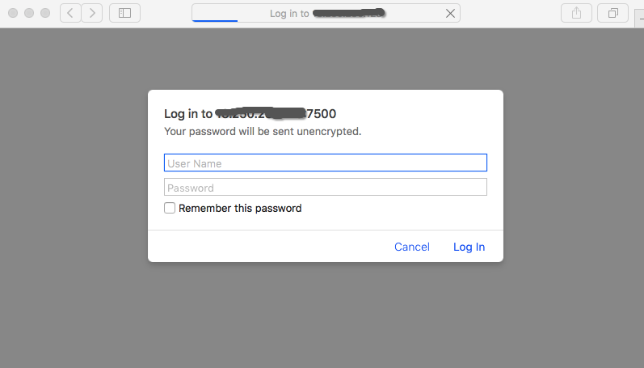
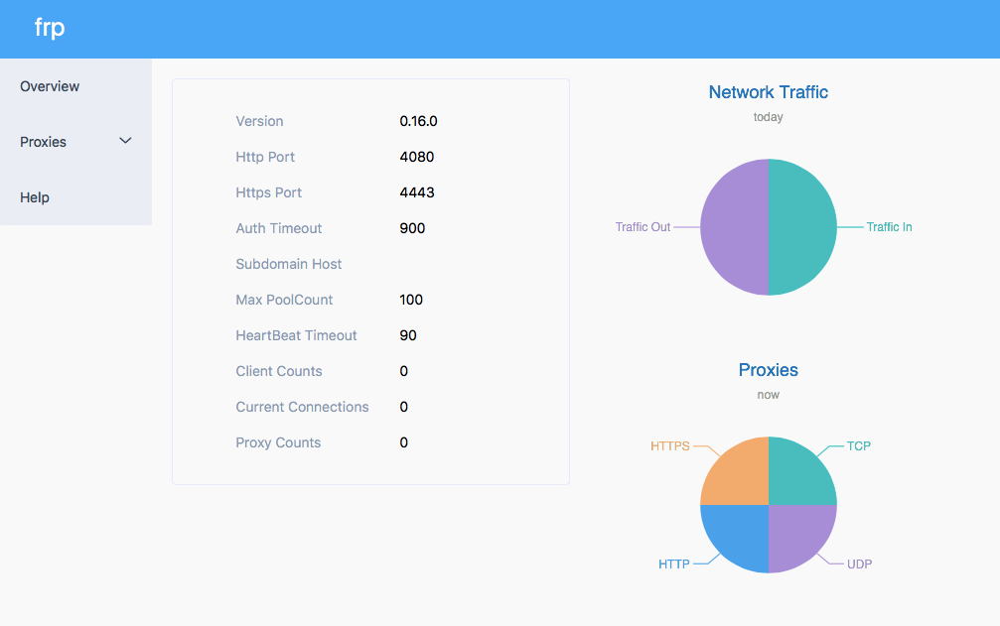

# ❖ 利用「frp」实现树莓派的公网映射（让外网访问本地局域网里的树莓派）

> 一直就想试试把本地电脑公开到公网实现自己做服务器的感觉，有了树莓派后更有这种想法。于是就动手试试。

听说目前两种方法比较流行：`ngrok`和`frp`。但是`ngrok`是收费的且复杂，`frp`则完全开源免费且简单易用，所以这里来尝试下。

大概思路就是：自己先有一台公网的服务器（我是在AWS或DigitalOcean租的），然后让本地的树莓派与公网服务器通过`frp`程序达成一种映射连接，这样别人访问公网服务器ip的某个端口时，就会自动转向来访问本地的树莓派了。

做法是：分别在服务器和本地树莓派上下载frp程序，当然要根据两者自己的系统平台下载不同版本。然后在服务器运行`frps`，即frp-server，在本地运行`frpc`，即frp-client。并且在配置文件里约定好，服务器的哪个端口映射到本地的哪个端口。双方都运行后，就可以正常通过外网访问了。

### frp有难度吗？

没有！

这个服务的环境、启动、安装等简单到让人发指，唯一的难度就在于服务器上和本地上两个`.ini`配置文件。
配置文件搞明白了，就什么都明白了。有一点不明白，就全不明白。。。

[参考文章。](https://mritd.me/2017/01/21/use-frp-for-internal-network-wear/)
[官方下载地址](https://github.com/fatedier/frp/releases)。其中，服务器如果是Ubuntu或Debian系的，就选择`linux_amd64.tar.gz`和`linux_386.tar.gz`结尾的，一个是64位一个是32位。本地树莓派如果是树莓派系统，则选择`linux_arm.tar.gz`结尾的。

## 第一：服务器上安装配置「frp」

```sh
#下载frp:
wget https://github.com/fatedier/frp/releases/download/v0.16.0/frp_0.16.0_linux_amd64.tar.gz
#解压:
tar -xzvf frp_0.16.0_linux_amd64.tar.gz
#进入目录:
cd frp_0.16.0_linux_amd64
#修改服务器端配置文件：
vim frps.ini

#将内容全部替换为如下：
# frps.ini
[common]
bind_addr = 0.0.0.0
bind_port = 7000
vhost_http_port = 8000
vhost_https_port = 8001
dashboard_port = 7500
privilege_token = 123456
dashboard_user = ubuntu
dashboard_pwd = 123
log_file = ./frps.log
log_level = info
log_max_days = 3
max_pool_count = 5
authentication_timeout = 900
tcp_mux = true
```

保存退出后，
就可以在当前目录通过`sudo ./frps -c frps.ini`启动服务器端的这项服务了。

测试：
随便找个浏览器，输入服务器的IP和刚刚设置的后台管理端口号，就可以访问了。比如我的服务器IP是13.250.64.172，那么就输入：`http://13.250.64.172:7500`
然后就可以看到如下:

然后按照刚才设置的账号密码：admin, admin就能登录到，显示如下图：



## 第二：本地树莓派装「frp」

本地配置要比服务器配置难很多，经常出问题。尤其是我的机器只要一设置ssh，就会出错。
基本配置如下：
```ini
[common]
server_addr = 服务器IP地址
server_port = 7000
privilege_token = 123456

log_file = ./frpc.log
log_level = info
log_max_days = 3
pool_count = 5
tcp_mux = true

[ssh]
type = tcp
local_ip = 127.0.0.1
local_port = 22
remote_port = 2200

[web]
type = http
local_port = 80
custom_domains = 服务器IP地址或服务器的域名（仔细填写，这是连接的主要方式）
```

保存退出后，在frp的文件夹执行：`sudo ./frp -c frpc.ini`，就能启动了。

现在，保证服务器端和客户端的两个服务都在同时运行时，我们就可以使用了。

连接好后，用这个命令连接ssh：
```sh
$ ssh ClientUser@ServerIP -p 2200
```

