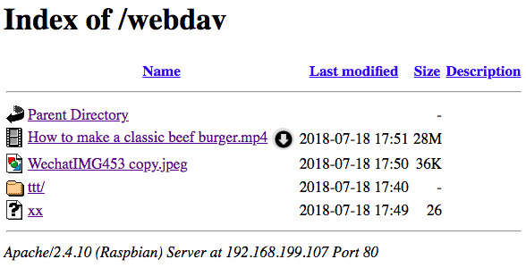
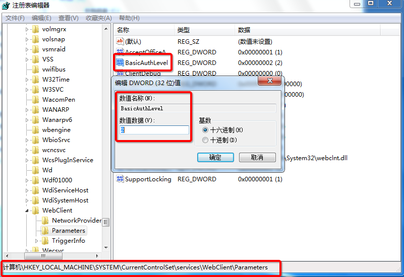
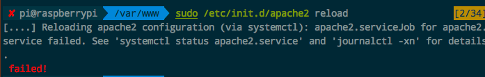
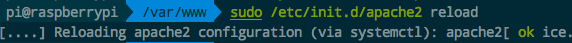

# ❖ Ubuntu安装WebDav文件共享服务器（NAS）

> 为了做个NAS，折腾了超久的Samba，看似简单，其实Samba的用户设置实在太繁琐，坑太深。用户权限和目录权限、甚至磁盘格式稍有不同，都会导致无法登录。实在不靠谱，实际体验也不是很稳定。
所以在找Alternatives过程中，发现了这个也存在了很久的WebDav协议。

不像Samba是一个微软开发的软件体系，WebDav只是一种协议，确切说是世界上最普遍的HTTP协议的一个小扩展。**它不是一个软件**。

> 所以就好理解，为什么搜索不到WebDav的官网和官方安装指南了——因为没有“官方”。谁都可以开发软件支持这个协议，就像水都可以开发浏览器支持HTTP协议浏览网站一样。

[参考：How To Set Up WebDAV With Apache2 On Debian Etch](https://www.howtoforge.com/setting-up-webdav-with-apache2-on-debian-etch)

```sh
# 安装Apache2服务器
sudo apt-get  install  -y apache2

# 开启Apache2中对WebDav协议的支持 (记住最好在用户目录下执行否则报错)
cd ~
sudo a2enmod dav
sudo a2enmod dav_fs

# 创建共享目录并修改权限
sudo mkdir -p /var/www/webdav
sudo chown -R www-data:www-data  /var/www/webdav

# 创建WebDav的访问用户数据库，顺便创建用户`pi`
sudo htpasswd -c /etc/apache2/webdav.password pi
# 创建guest用户
#sudo htpasswd /etc/apache2/webdav.password guest

# 修改用户数据库访问权限
sudo chown root:www-data /etc/apache2/webdav.password
sudo chmod 640 /etc/apache2/webdav.password

# 打开默认配置文件
sudo vim /etc/apache2/sites-available/000-default.conf

# 全部替换为以下内容（记得先备份）：

Alias /webdav  /var/www/webdav

<Location /webdav>
 Options Indexes
 DAV On
 AuthType Basic
 AuthName "webdav"
 AuthUserFile /etc/apache2/webdav.password
 Require valid-user
 </Location>

# 重启Apache2服务器
sudo systemctl restart apache2
# 或
sudo /etc/init.d/apache2 reload
```

然后就可以用任意浏览器输入：`http://树莓派的IP地址/webdav`来访问了。
注意，`webdav`后面没有`/`斜杠。

网页中如果正常显示目录中的文件结构，则可以正常访问：


这一步完成，我们就可以开始把这个共享文件夹映射到Mac、Windows上的本地文件夹了。


## 磁盘映射
网页里只能像FTP一样显示文件目录和下载文件。
如果要正常使用，我们需要把它映射为本地目录才行：
- Mac上：在Finder中用`CMD+K`打开连接服务器选项，输入`http://树莓派IP地址/webdav`，输入Webdav创建过的用户名密码来完成映射。
- iPhone上：安装网盘访问最强的`Readdle Documents`，添加WebDav服务，输入信息后就可以访问。直接看文档、看视频、听歌都行。
- Windows上：比较麻烦的是，Win7以上默认只支持HTTPS的网络驱动器，做为HTTP的WebDav是不能连的。所以要修改Windows注册表，让它支持HTTP。方法入下：
    - 开始菜单 -> 运行 -> 输入regedit 并按回车，就打开了注册表 
    - 注册表中找到`HKEY_LOCAL_MACHINE\SYSTEM\CurrentControlSet\Services\WebClient\Parameters\BasicAuthLevel`这个项目，把值改为`2`。
    - 开始菜单 -> 运行 -> 输入cmd 并按回车，打开命令行
    - 输入`net stop webclient`并按回车，停止网络客户端
    - 输入`net start webclient`并按回车，开启网络客户端
    - 然后在文件夹菜单中找到`映射网络驱动器`，输入网址`http://树莓派IP地址/webdav`或`\\树莓派IP地址\webdav`，然后输入用户名密码，就能映射成功了。
- 浏览器上：随便什么设备，只要是个浏览器就能支持。可以在线播放常用视频，直接打开图片浏览。但是不能上传。




## 挂载外部磁盘（移动硬盘、U盘）
和Samba一样，只要在`/var/www/webdav/`这个共享出来的文件夹中，创建个空目录，然后把移动硬盘用`mount`命令挂载到这个目录上。外部就可以访问了。


## 使用速度和感受
配置上，比Samba不知道简单到哪里去了。

实验证明，速度非凡！
Mac映射完成后，访问就像本地文件夹一样快，而且可以直接看视频、预览图片、支持原本各种快捷键等。
还可以直接拖放文件来复制，速度也快到和本地复制文件没有区别。
如果对比Samba，最明显的是看图片和视频的打开速度。
Samba要等一秒以上，而WebDav几乎没有等待，或者说和本地打开文件一样速度。
唯一缺点是，Windows访问的话，是很卡很卡的。

稳定性上，因为是基于Apache2的，bug非常少，权限也不用傻傻分不清（和本地用户也没关系）。

远程访问上（我在AWS新加坡服务器上建的WebDav），速度也相当可靠，比我访问树莓派的WebDav还快。毕竟亚马逊服务器配置高网速快。只是视频访问就没那么方便，经常卡顿、发生异常。但是也比较满意了。

总结：WebDav配置方便，访问轻松，权限管理轻松，稳定，超多平台支持，完美！


## 常见问题

### Apache2 Reload出错


用命令`sudo /etc/init.d/apache2 reload`重启服务器没有反应，用命令`sudo /etc/init.d/apache2 reload`重新加载Apache2时也报错：
```sh
[....] Reloading apache2 configuration (via systemctl): apache2.serviceJob for apache2.service failed. See 'systemctl status apache2.service' and 'journalctl -xn' for details.
 failed!
```

一般来讲，很有可能是80端口被占用了，有可能是Nginx。
所以要找到占用端口的服务，并关闭它。

具体方法如下：
```sh
# 找到所有nginx相关进程
$  ps -ef |grep nginx

# 按照显示出的nginx进程号逐一关闭
$ sudo kill -TERM 进程号
# 或
$ pkill -9 nginx

# 重新加载Apache2服务器
$ sudo /etc/init.d/apache2 reload

# 重启Apache2服务器
$ sudo systemctl restart apache2
```

Reload后成功后就会显示：


这样再用浏览器尝试访问webdav服务的网址，就OK了

## 为什么访问WebDav很慢
一般来讲，无论是WebDav还是Samba，访问速度慢主要有这些因素：
- 服务器网速不够
- 本机客户端电脑的网速不够
- 路由器速度有限
- 服务器硬盘（或U盘）配置太低（转速低）
- 服务器主机电脑配置低：CPU、内存都不足 （树莓派就是这样）
- 客户端所在的电脑配置低

所以，如果以上所有原因都不构成连接速度慢的原因的话，才需要考虑是不是WebDav软件设置和架构出了问题。


