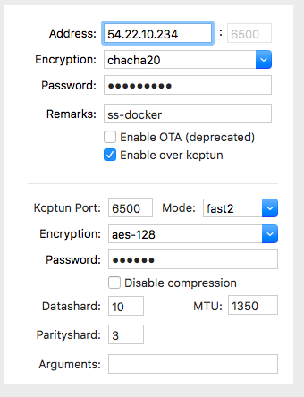

# ❖ Shadowsocks 多种加密方法、多端口、多用户、多配置的完美方法
`——副标题：Shadowsocks与Docker的完美结合`

因为最近不知道怎么的总掉线，连最基本的ssh也断断续续连接，怀疑默认使用的`aes-256-cfb`加密方式也被发现了。所以想试试比较新比较靠谱的加密方法。

网上众多人推荐`chacha20`系列的加密比较多，但是发现Ubuntu服务器上怎么装也装不好，非常麻烦。正想放弃之余，突然想起了最近学习的docker。果不其然，docker提供了最优的镜像，相当靠谱。

[推荐关注和下载排名第一的镜像：mritd/shadowsocks](https://hub.docker.com/r/mritd/shadowsocks/)

这个镜像编译好了非常丰富的shadowsocks相关的内容，甚至包括了`kctptun`。
执行极其简单，只要你服务器有docker，就什么配置文件都不需要改，一句命令就连镜像的下载、执行、shadowsocks的运行、kcptun的运行、系统自动启动等全配置好了：
```sh
$ docker run -dt --name ssserver --restart always \
    -p 6443:6443 -p 6500:6500/udp mritd/shadowsocks -m "ss-server" \
    -s "-s 0.0.0.0 -p 6443 -m chacha20 -k shadow123 --fast-open" \
    -x -e "kcpserver" -k "-t 127.0.0.1:6443 -l :6500 -mode fast2 -key kcp123 -crypt aes-128"
```
上面相当于在容器里执行了两个命令：
```sh
$ ss-server -s 0.0.0.0 -p 6443 -m chacha20 -k shadow123 --fast-open
$ kcpserver -t 127.0.0.1:6443 -l :6500 -mode fast2 -key kcp123 -crypt aes-128
```
也就是说：
- 现在开放了`6443`端口作为Shadowsocks连接，密码是`shadow123`，加密方法是`chacha20`
- 同时开放了`6500`端口作为Kcptun连接，模式是`fast2`，密码是`kcp123`，加密方法是`aes-128`
- 使用了`--restart always`参数，让容器随系统自动启动。无需自己改`rc.local`了

然后你就可以根据需要，在自己的客户端任选shadowsocks或kcptun连接。

加上Kcptun的Shadowsocks-NG客户端设置如下：



测试完美通过。


本地测试后发现，不知道是docker还是`chacha20`的加密原因，我的网速加速了一倍以上。在同一台机器上，之前用`aes-256-cfb`加密时，看youtube的`connection speed`是3000kb/s，现在是6000+kb/s.

如果需要开放多个端口、多个配置、多个加密方法，那就多运行几个docker容器就行了，当然，每个容器必须是不同的端口。亲测完全有效。

具体更详细的参数配置，参考该docker镜像的网页（中文）。
