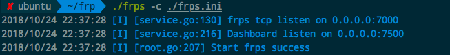
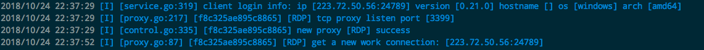
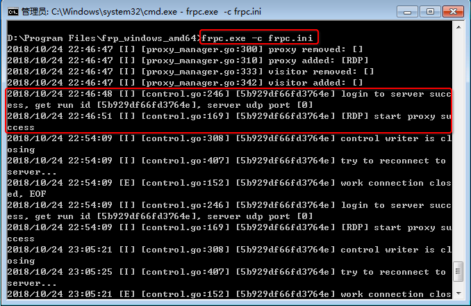
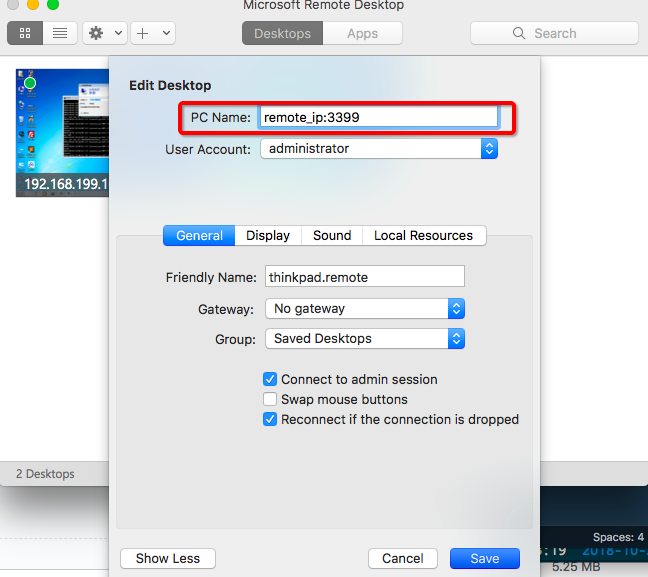
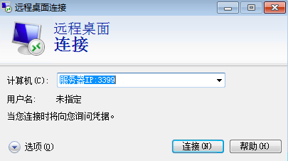

# ❖ 利用「frp」将家中Windows电脑内网穿透从远程连接

> 有时候需要连接一下家中的Windows笔记本，或者出差在外地的家人的笔记本（相当于远程修电脑了）。所以正在研究一个方便的远程连接方法。frp是最方便的。

首先声明：
- 被连接的电脑(Client): Windows系统，已经在控制面板里允许远程连接。
- 中介电脑（Server)：AWS亚马逊或阿里云的主机，Ubuntu 64位系统，最低配置即可
- 访问设备（Device)：手机、电脑或任何设备，已经安装了app，可以访问远程桌面。

## 服务器端设置

- 到[frp官方Github Releases](https://github.com/fatedier/frp)下载对应机型的压缩包
- 在服务器随便找个位置解压缩frp
- 进入frp文件夹
- 编辑服务器端配置文件`frps.ini`：
```ini
[common]
#Bind all local network interfaces
bind_addr = 0.0.0.0 
#Expose local port for client to connect with
bind_port = 7000 
#Connection password to validate client
privilege_token = frp123 

# Dashboard settings
dashboard_port = 7500 
dashboard_user = ubuntu 
dashboard_pwd = 123 
```
- 在frp文件夹中，运行frp服务: `./frps -c ./frps.ini`。正常应显示如下：

- 如果有客户端连接的话，会显示：


> 注意：服务器端配置不需要太去研究，保持最简单即可。主要用的只有`7000`接口，供给客户端建立隧道连接。

## 客户端
客户端在这里，是代表我们真实要访问的设备。
是客户端与服务器形成一个秘密隧道，让我们可以在任意位置、从任意设备，通过访问服务器即可访问到客户端。

操作步骤如下：
- 到[frp官方Github Releases](https://github.com/fatedier/frp)下载对应机型的压缩包
- 在服务器随便找个位置解压缩frp
- 进入frp文件夹
- 编辑客户端配置文件`frpc.ini`：
```ini
[common]
server_addr = 52.194.165.82
server_port = 7000 
#Connection password, must be same with server
privilege_token = frp123 

# Microsoft Remote Desktop
# RDP protocol is based on TCP
[RDP] 
type = tcp 
local_ip = 127.0.0.1 
# RDP default port
# Default port for RDP protocol is 3389
# local_port is to map local_ip:3389 to remote_ip:3399
local_port = 3389
remote_port = 3399
```
- 打开Windows的CMD命令行，cd到frp所在文件夹
- 运行frp服务的命令: `./frpc -c ./frpc.ini`。正常连接到服务器后应显示如下：


优化运行方式：
每次都打开CMD然后输入命令太麻烦。我们可以建一个BAT脚本文件，保存命令，然后直接双击即可运行：
- 新建`开始远程连接.bat`文件，并开始编辑
- 假设frp的文件夹位于`D:\Program Files\frp`
- 在bat文件中输入`"D:\Program Files\frp\frpc.exe" -c "d:\Program Files\frp\frpc.ini"`
- 保存退出
- 双击bat文件，即可运行。


## 设备连接

不管是从iPhone／iPad／Mac／Windows还是什么设备，不管是在Wifi下，在手机流量下，都可以连接。
从远程桌面的app上，简单的连接`服务器IP:3399`，然后按照客户端机器的用户名密码输入进去，即可连接。
注意，3399端口是指的刚才的`remote_port`设置。


### 从Mac连接到远程桌面
最简单的就是下载一个微软官方的app：`Microsoft Remote Desktop`，然后输入地址并指定登录账户即可：



### 从iOS连接到远程桌面
和Mac一样，安装微软官方的app：`Microsoft Remote Desktop`，然后输入地址并指定登录账户即可。


### 从Windows连接远程桌面
直接在开始菜单中搜索找到`远程桌面`，然后简单的输入地址（不需要其它设置）：


