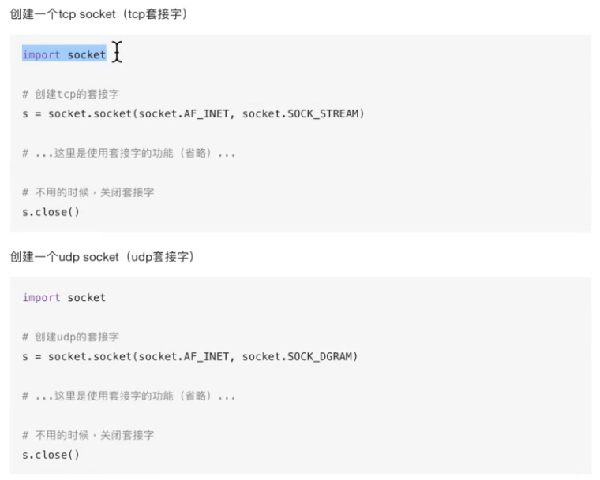
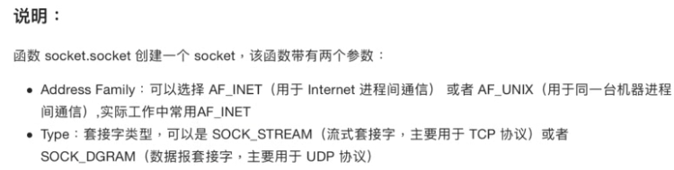

# ❖ 理解Socket通信 [DRAFT]

要实现所有的网络协议，就需要编程来让不同主机之间接收和发送通信。而实现主机之间通信的编程方式，就是采用`socket`方式。

现今几乎所有的网络间通讯，几乎100%都在用socket进行通讯。

本地的进程之间有很多种沟通方式，毕竟是同机器内。但是网路进程间，即一台电脑的某个进程和另一台电脑的某个进程间通讯，就几乎只能用socket进行通讯了。所以socket相当于网络通讯的基石。

> 如果说网络协议就是两个人签署的合同，那么socket就是作为中间传递快递的快递员。

`socket`是一种`网络进程`间沟通的方式，即不同主机之间的进程沟通。只要正确的标示出不同主机的进程地址，如`IP:port`就是代表一台主机的某个进程(因为一个端口对应一个进程)。有了这个地址，就能互相交流了。

那么，socket是怎么达到不同进程间通讯的呢？
其实很简单，就是：

**互相往对方的一个文件写入数据，然后分别读取自己被人写入的数据。**

> 这是*nix的`一切皆文件`的理念。

所以socket通讯的编程操作流程，几乎和我们打开关闭一个文本文件一样。

### Socket在TCP连接上的作用

socket在调用connect()方法时，实际上是执行了三次握手的连接验证。
这时，双方电脑都用socket互相在对方的电脑上写文件。
socket在调用close()方法时，实际上是执行了四次挥手的操作。

为什么关闭TCP连接要四次握手？因为socket，因为socket是两台电脑互相往对方写文件，必须要保证双方都停止往对方写入才行。这就需要四次握手了。

## Python创建socket

