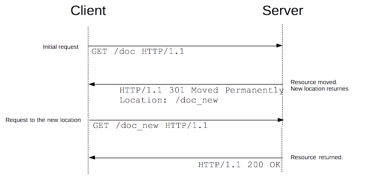

# ❖ HTTP 的重定向

一直好奇，当我们request一个URL时候，它是怎么在后台就转向了。
浏览器是接收到什么指令了才会被重定向？在Headers中？在文档中被JS脚本重定向？还是什么？

[参考Mozilla超好看文档：HTTP 的重定向](https://developer.mozilla.org/zh-CN/docs/Web/HTTP/Redirections)

也就是说，命令客户端的浏览器对一个URL重定向的方法有：
- (*) 通过`Status Code`+`Headers: Location`来命令浏览器重定向至`Location`的网址
- HTML的头部的`<meta>`标签中设置重定向。但是只适用于HTML，类似图片等其它资源就不行了
- Javascript脚本中写`window.location="..."`重定向。同样只适用于能加载JS的客户端，不适合其它资源。


## 通过Status Code状态码重定向

这种方法是最标准、适应度最广泛的：也就是无需HMTL，无需浏览器，无需BODY，只要Headers即可要求接收者重定向。

原理图：



要求重定向的状态码有：
- 永久重定向
    - 301
    - 308
- 临时重定向
    - 302
    - 303
    - 307
- 特殊重定向
    - 300
    - 304


## Python获取每次重定向的地址

一般来说，我们用`requests`的方法，
```py
r = requests.get(uri, allow_redirects=True)
print( r.url )

for jump in r.history:
    print( jump.url )
```

但是最近在使用一些WebAPI时候，如Oauth2.0的时候，只有登录后才会重定向。
所以如果程序中没有做到登录，后台就不会重定向。也就是说，request的时候我们要加入cookies登录信息，而且是对应着最开始response中的`set cookies`设置的cookies才能被重定向。

```py

```
