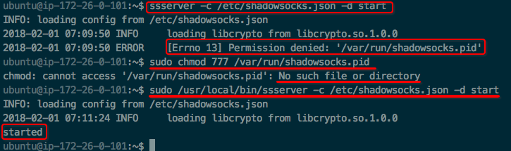

# Shadowsocks 服务器安装

1.创建服务器
2.创建时选择SSH Key，上传本地制作的密钥文件，如`~/.ssh/id_rsa.pub`
3.记住本地SSH Key密钥的访问密码，这样每次登录服务器只要输入它就行了。
4.打开终端, 利用SSH连接,如DigitalOcean是`$ ssh root@ip-address`，Lightsails就是`$ ssh ubuntu@ip-address`
```shell
sudo apt-get update
sudo apt-get install python-pip -y
# 如果提示需要升级pip
# pip install --upgrade pip
pip install shadowsocks
sudo vi /etc/shadowsocks.json
{
    "server":"0.0.0.0",
    "server_port": 1111,
    "password":"aaaaaaaa",
    "local_address":"127.0.0.1",
    "method":"aes-256-cfb",
    "local_port":1080,
    "timeout":300,
    "fast_open":false
}
```

sudo ssserver -c /etc/shadowsocks.json -d start

如果遇到 permission denied错误, 试一下改变下面文件权限:
```shell
sudo chmod 777 /var/run/shadowsocks.pid
sudo chmod 777 /var/log/shadowsocks.log
```
如果还是不行，那么试试直接按照ssserver的路径启动：
```
sudo /usr/local/bin/ssserver -c /etc/shadowsocks.json -d start
```


