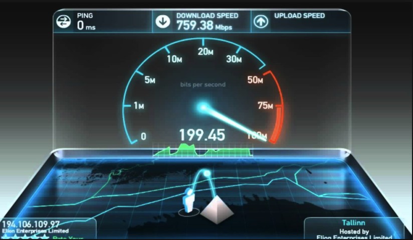
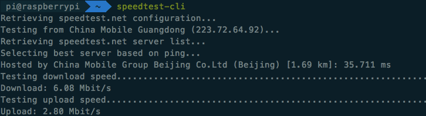

# 命令行方式的网络测速 Speed Test
一般最靠谱的网速测速是`Ookla Speedtest`这个网站，不管在国内还是国外。

不过其实它还有命令行的访问方式，这种方式最适合树莓派或者远端服务器这样的看不到显示器的网速测试。
直接在命令行里一句话（是一个词就够）就能返回一系列的测试结果。
官方Github网站在这里：[https://github.com/sivel/speedtest-cli](https://github.com/sivel/speedtest-cli)
安装方式是：只要在自己或者服务器的命令行里输入`sudo pip install speedtest-cli`即可，下载好后，直接在命令行里输入`sppedtest-cli`，回车，就会出现测试过程和结果。

