# ❖ Linux上各种网络端口流量监控的工具对比使用

> 尝试过太多了，总结：都没太大用处，顶多也就看看当前系统某网卡的进出流量。最后还是系统默认的`iftop`最靠谱。

一键安装所有常用的网络监视软件：
```shell
# Ubuntu
sudo apt-get install -y iftop dstat nload iptraf ifstat nethogs bmon slurm vnstat bwm-ng cbm speedometer 

#Mac 
brew install iftop dstat nload iftraf ifstat nethogs bmon slurm vnstat bwm-ng cbm speedometer 
```

###  `iftop` 统计所有端口流量 （没法统计某个端口）
一般是默认安装的，
需要sudo权限：`sudo iftop`。
[参考文章](https://my.oschina.net/lionel45/blog/261234)
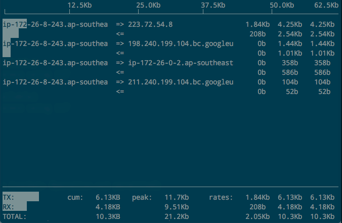

[参考文章](https://segmentfault.com/a/1190000002797441)
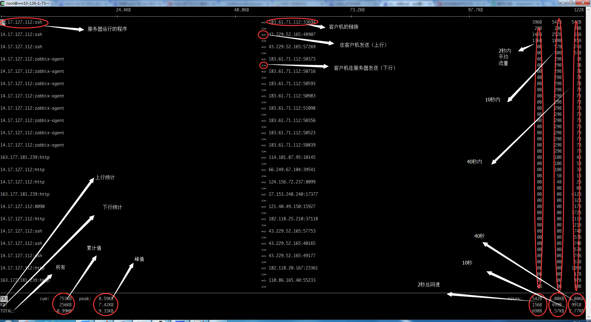


### `iptraf`
能够看到每个网卡的当前流量，如600 kbits/sec
注意，一开始的显示颜色会很难看，需要艰难地在菜单里选择color，然后重启程序，才能正常显示。
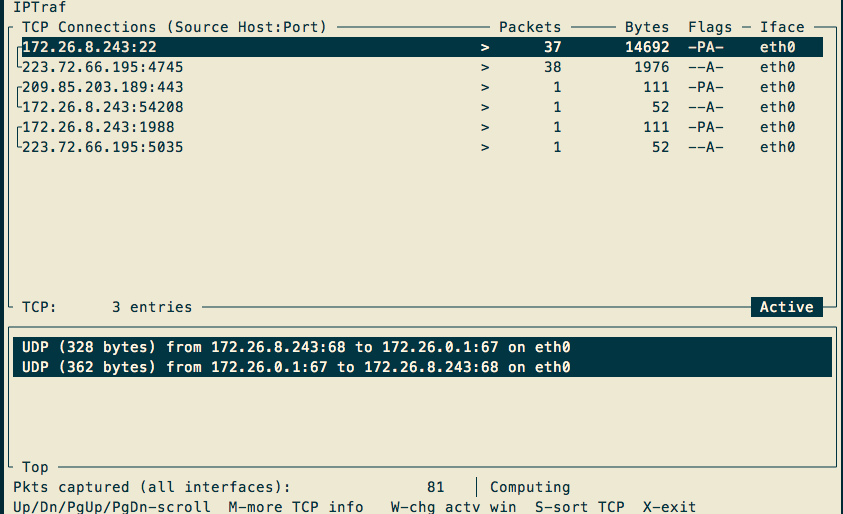

### `bmom`
动态柱状图显示进、出的流量和秒速。页面比较友好，信息简单。
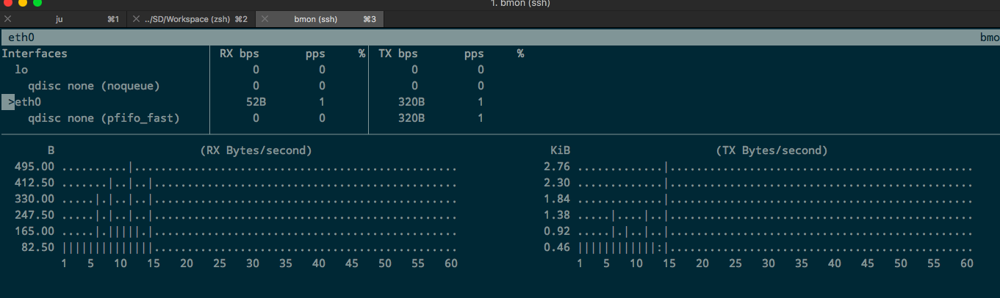

### `vnstat`
画面简单，但不是动态的。只是总结日平均、月平均等。
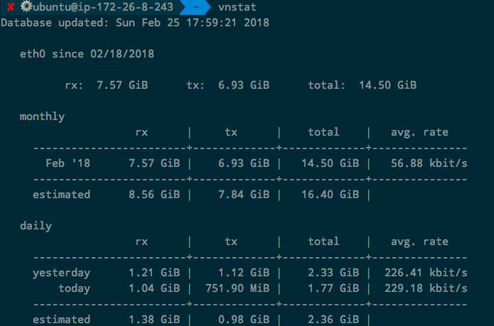

### `bwm-ng`
功能超少超简单，只显示进出流量。
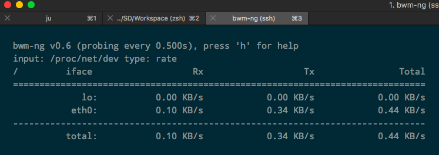

### `cbm`
只显示进出流量。
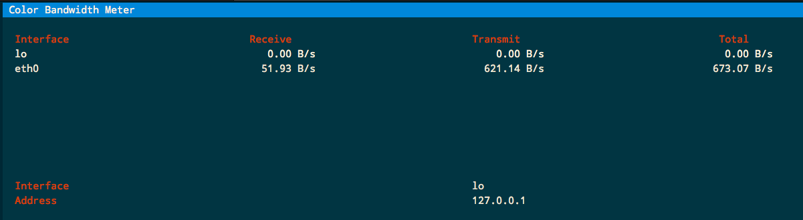

### `speed-meter`
需要输入`speedometer -r eth0 -t eth0 `执行。
只显示简单信息。但是带颜色和每个峰值的标注的界面好看。
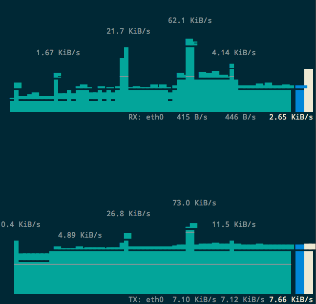

### `slurm`
命令是`slurm -s -i eth0 `。信息很少：
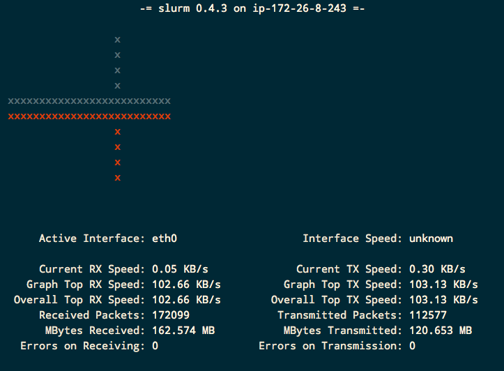

### `ntop`
安装还需要用户名密码，这对于服务器来说太不友善了。装完了后，还打不开。。。

### `dstat`
可读性不强，也没什么好玩的显示出来。
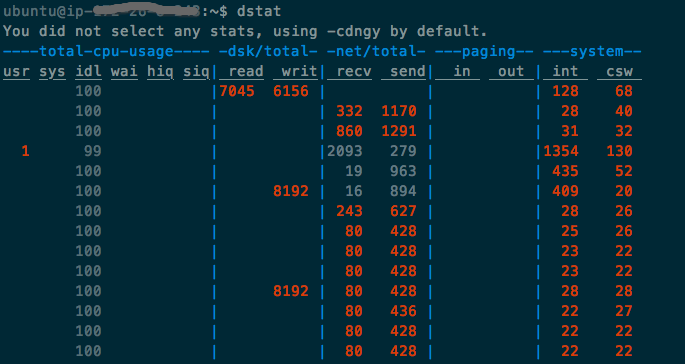


### `nload`
画面简单，沾满全屏，只告诉你当前incoming和outgoing的流量速度。
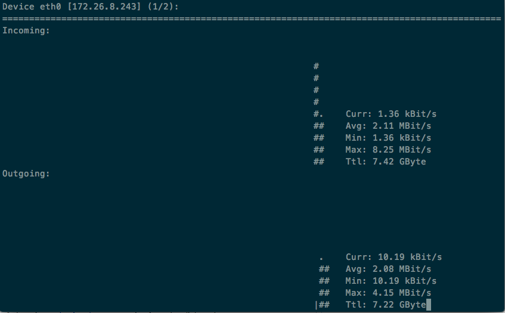

### `ifstat`
极其简单只显示两个数值：进和出的秒速。
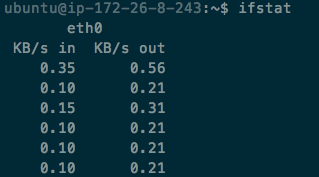

### `nethogs`
需要sudo才有权限运行。
按用户显示每个用户所用的流量，基本上没什么用，数值也少。
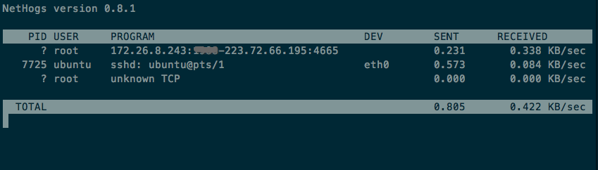


