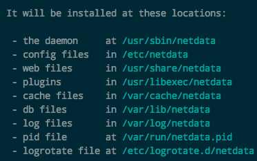
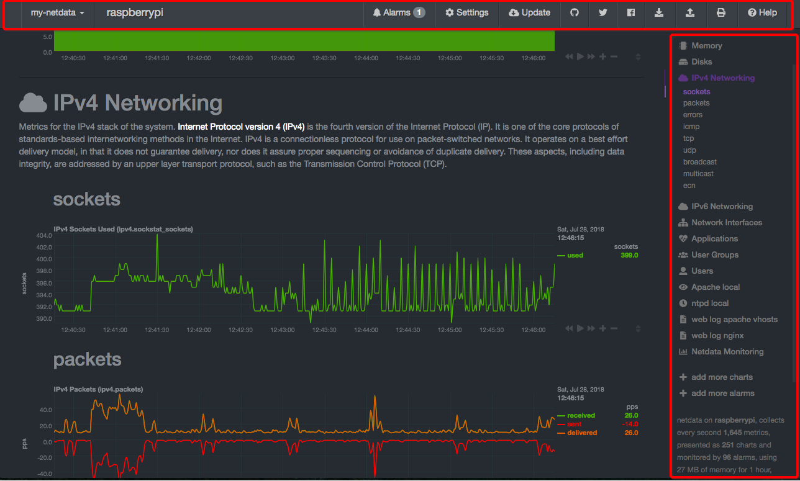
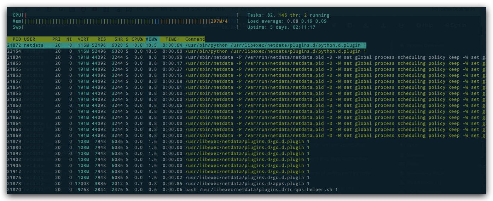
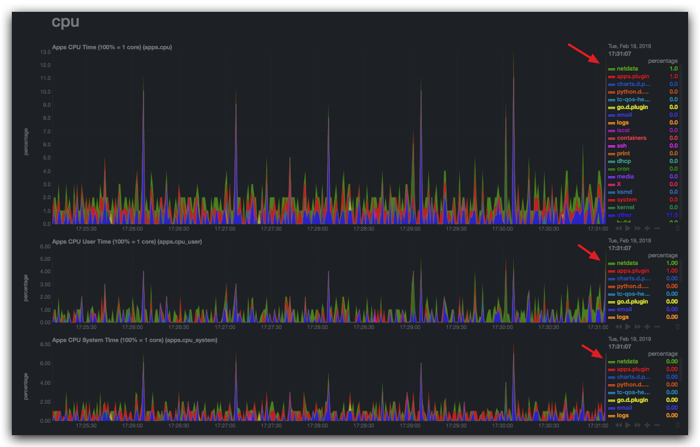
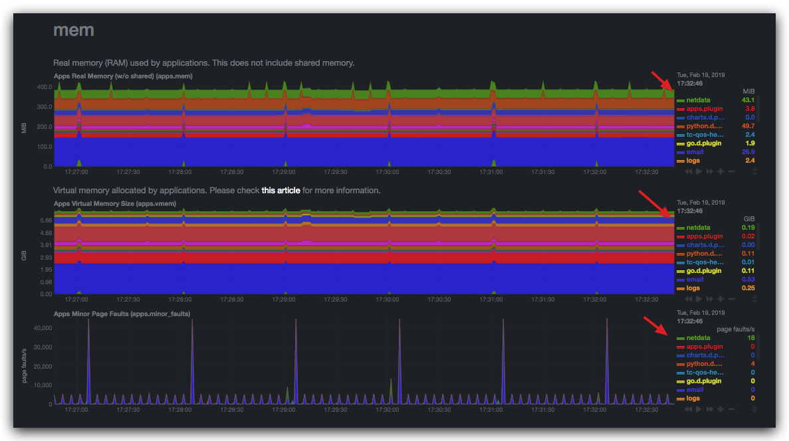
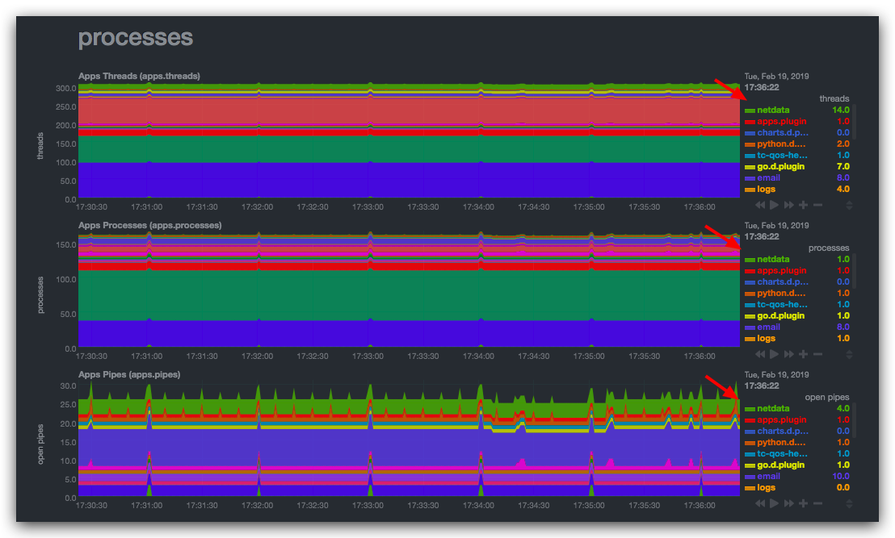

# ❖ Netdata 最帅Linux系统监控工具

一直在找方便的监控Linux系统状态和网络进出的，试了很多种都各有优缺。只有Netdata是安装最简单、显示最好看、最全面的监控工具。

> 注意，安装后会严重影响服务器运行速度，且默认安装的话安全性很低（默认没有密码，默认端口访问可以直接看到全部系统信息）


[参考GIthub： Netdata](https://github.com/firehol/netdata)

用脚本安装：
```sh
# 基本安装（适合所有Linux系统）
$ bash <(curl -Ss https://my-netdata.io/kickstart.sh)

# 或者从头安装（安装所有依赖包）
$ bash <(curl -Ss https://my-netdata.io/kickstart-static64.sh) 
```
脚本会检测当前系统环境，然后从头编译安装软件。

或者通过报管理器安装（目前各种包管理器的支持还不是很全）：
- Arch Linux (`sudo pacman -S netdata`)
- Alpine Linux (`sudo apk add netdata`)
- Debian Linux (`sudo apt-get install netdata`)
- Gentoo Linux (`sudo emerge --ask netdata`)
- OpenSUSE (`sudo zypper install netdata`)
- Solus Linux (`sudo eopkg install netdata`)
- Ubuntu Linux >= 18.04 (`sudo apt install netdata`)
- MacOS (`brew install netdata`)

安装大概占用28MB空间。

根据提示，netdata会在这些位置安装文件：




安装好后，就可以直接打开浏览器：`localhost:19999`看到超酷的画面了（网页很长，显示超多数据）。



Netdata在安装后，主要是作为`服务运行`的。

开关控制：
```sh
# 启动：位置根据系统会有不同。建议加上-D参数前台运行，不要后台运行
$ sudo netdata -D
$ 或
$ sudo /usr/sbin/netdata -D
# 或（Mac上）
$ sudo /usr/local/sbin/netdata -D

# 关闭（方法很多种，往往只有一种生效）
$ sudo killall netdata
# 或
$ sudo pkill -9 netdata
# 或
$ sudo service netdata stop
# 或
$ sudo /etc/init.d/netdata stop
# 或
$ sudo systemctl stop netdata
```


卸载：
```sh
# 找到卸载脚本位置(我的在/usr/src/netdata.git)
whereis netdata.git
#  进入那个位置
cd /usr/src/netdata.git
# 开始卸载
yes | sudo ./netdata-uninstaller.sh --force
# 删除其它遗留信息
sudo userdel netdata
sudo groupdel netdata
sudo gpasswd -d netdata adm
sudo gpasswd -d netdata proxy
```

卸载其它被安装的软件：
```sh
yes | sudo apt-get purge ntop snapd
```

## 使用感受
网页浏览庞大精确系统信息的确很爽。
但是！
严重影响服务器速度！长期占用10%内存和很高的CPU。
而且还发现Netdata为了监控，还安装了很多其它软件，长期在后台运行。
甚至严重到影响SSH的延迟，ssh进去后打字反应都很慢。
所以没办法就卸载了。

卸载Netdata软件本身，和其它被这个安装的大量占用内存CPU的后台驻留软件后，重启服务器，又恢复了以前的速度。


## 更新

近期Netdata在Reddit上发布了v1.12更新。
由于我在下面发了回应说了下自己不好的感受，引发了主创者的质疑。
下面是链接：
https://www.reddit.com/r/docker/comments/as08my/netdata_the_opensource_realtime_performance_and/egs8ljq

意思是：我认为我在AWS上的实例因为安装了Netdata监控，而占用了大量CPU和内存，导致SSH连接操作速度下降，所以卸载了Netdata。但是主创者认为Netdata不可能导致这个后果。

所以我又再一次安装了Netdata，下面是内存占用的截图：



这个是从Netdata的Dashboard从查看的应用CPU占用：




这个是从Netdata的Dashboard从查看的应用内存占用：



这个是从Netdata的Dashboard从查看的应用进程占用：




可以看到，各项应用占用，`netdata`都排在第一。
但是这次SSH到远程主机，并没有以前感受到的那种延迟，操作也没什么反应。
发现也许是我当时的网络“受污染”导致的速度减缓，可能和Netdata没什么关系。

当时卸载的原因就是各项它都排第一，所以认为是它导致的。
