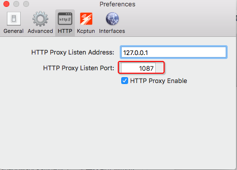

# ❖ Shadowsocks命令行中的本地客户端配置

> 有时候想让树莓派访问一些屏蔽的网址，所以只能用命令行的客户端。

[参考文章](http://www.jeyzhang.com/how-to-install-and-setup-shadowsocks-client-in-different-os.html)

简单说就是：
```shell
sudo apt-get install m2crypto
sudo pip install shadowsocks

#启动Shadowsocks
sslocal -s 服务器域名或IP -p 服务器端口号 -k “密码” -l 1080 -t 600 -m rc4-md5 
```

当然，启动方式还有从配置文件的方法。
首先在某处创建配置文件，比如`~/.shadowsocks-client.json`，内容如下：
```javascript
{
    "server":"服务器IP地址",
    "server_port": 服务器端口,
    "password":"服务器密码",
    "local_port": 1080,
    "timeout": 600,
    "method":"aes-256-cfb"
}
```
然后用这个命令启动：`sslocal -c ~/.shadowsocks-client.json`

## 启动之后
启动之后，就不要关闭命令，只能打开另一个命令行窗口操作。
现在命令行直接访问网络其实没什么变化，因为目前开启的socks5协议端口，也就是说刚刚设置的本地1080端口是socks5协议的，必须在curl里指定socks5协议，再去访问网络：
```shell
curl --socks5-hostname 127.0.0.1:1080 httpbin.org/ip
```
不过功能强大能访问socks5协议端口的，估计也就curl了。如果使用别的命令如wget之类的，就只能访问http和https协议端口。
这样的话我们就必须`把socks5端口转换为http端口`。

## Shadowsocks转换HTTP代理
因为考虑到很多程序都是用http端口为代理出去的，所以我们要把socks5端口映射为某个http端口。
这里就需要用到另一个软件：`polipo`。
[参考文章。](http://baoye.me/2016/10/17/%E5%9F%BA%E4%BA%8E%E6%A0%91%E8%8E%93%E6%B4%BE%E4%BD%BF%E7%94%A8Shadowsocks%E7%BF%BB%E5%A2%99/)

1. 输入命令安装Polipo:
`sudo apt-get install polipo`

2. 修改配置文件:
`sudo vim /etc/polipo/config`

3. 把文件内容全部替换如下：
```shell
# This file only needs to list configuration variables that deviate
# from the default values.  See /usr/share/doc/polipo/examples/config.sample
# and "polipo -v" for variables you can tweak and further information.
logSyslog = false
logFile = /var/log/polipo/polipo.log
socksParentProxy = "127.0.0.1:1080"
socksProxyType = socks5
chunkHighMark = 50331648
objectHighMark = 16384
serverMaxSlots = 64
serverSlots = 16
serverSlots1 = 32
proxyAddress = "0.0.0.0"
proxyPort = 1087
```
注意：上面这个`proxyPort = 1087`是要映射出来的http端口，自己随便设置。但是要记住它。

4. 设置`http_proxy`环境变量
`sudo vim /etc/profile`
写入
`export http_proxy="127.0.0.1:1087/"`

5. 重启Polipo: `sudo /etc/init.d/polipo restart`
6. 检查效果： `curl -x 127.0.0.1:1087 httpbin.org/ip`
完成！

## 在Mac中命令行走代理
由于Mac中使用的GUI客户端，所以很多东西都配置好了，在命令行中访问就方便很多。

[参考文章。](https://github.com/mrdulin/blog/issues/18)
如果是配置的Shadowsocks，那么在GUI启动了shadowsocks的情况下，需要找到正确的本地映射端口。在GUI的设置页面里面可以找到HTTP的映射端口：

那么，比如使用curl时，就应当用http如此访问：
`curl -x http://127.0.0.1:1087 httpbin.org/ip`
其它软件也同理，选择http方式的该地址和该端口，就能正确连接了！
