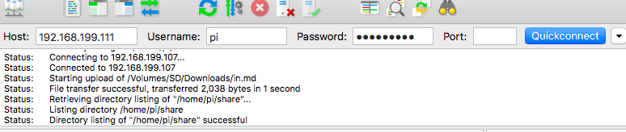
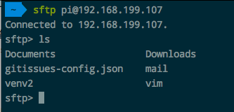
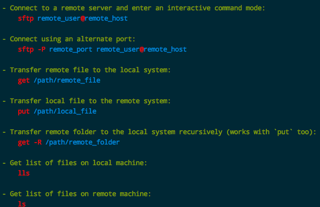

# 服务器安装FTP
> 需要说明下，Linux最常用的ftp服务器端就是`vsftpd`了。
但是，配置起来非常麻烦，网上众说纷纭，怎么写的都有，怎么出错的也都有。
下面我尽量小心的总结一些我使用通过的配置。

主要步骤是：
- 安装：很简单，`sudo apt-get install vsftpd`
- 配置文件：`sudo vim /etc/vsftpd.conf`，然后按照自己的需求配置文件
- 重启ftp服务：`sudo /etc/init.d/vsftpd restart`

以下是我尝试过的几种常用的`/etc/vsftpd.conf`配置方法：

## 最简单配置
> 以下内容为我所知道的最简单配置：不允许匿名登录，使用默认的linux用户和密码登录，完全权限。

```shell
#禁止匿名访问
anonymous_enable=NO
#允许上传
write_enable=YES
```
然后使用FileZilla这样的FTP客户端试着登录一下：输入ip地址，用户名和密码，选择快速登录。
注意，要选择`sftp`而不是`ftp`，否则无法成功登录。



## 匿名用户配置
> 如果是本地虚拟机或是自己家里的电脑的话，完全匿名就OK了，不需要设置那么麻烦的安全限制。

完整配置如下：
```shell
#
```

## 单独ftp用户配置
> 这种方式的好处在于，可以专门创建一个user用户，限制它能访问的目录和权限。
但是就是这种配置，是最麻烦最容易访问失败的。做好心理准备。

完整配置方案如下：
```shell
# 
```

## `本地FTP客户端命令工具：sftp`
除了FileZilla这种GUI工具外，我们在命令行里也能轻松登录远程的FTP服务器。Mac和一些Linux上都自带`ftp`和`sftp`工具，操作很简单。
比如上述`最简单配置`，我们就可以用`sftp`工具来登录ftp服务器，方便的上传和下载文件。

命令很简单：
- 进入sftp的互动shell： `$ sftp USER@IP`，如：

- 上传：`$ put LOCAL-FILE-PATH`
- 下载：`$ get REMOTE-FILE-PATH`



