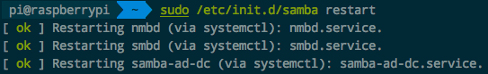
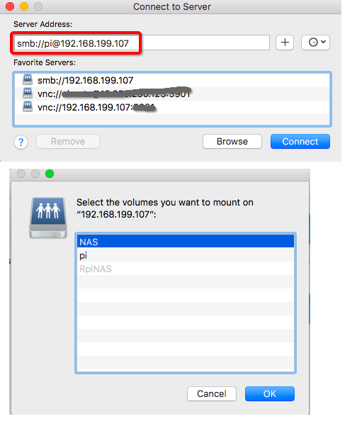
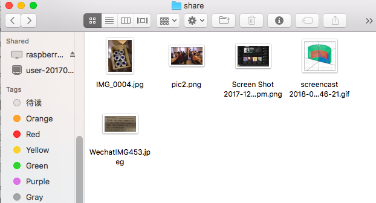
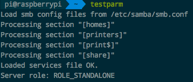
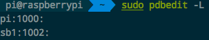

# ❖ Ubuntu安装Samba文件共享服务器（NAS）

终于有点时间来解决下家中NAS需求了。一般自制NAS，只有选Samba。速度比FTP快，便利性比Windows文件夹共享好，设置多等等。

[▶参考：samba简介](https://github.com/jaywcjlove/handbook/blob/master/CentOS/samba.md)

## 安装Samba
```sh
$ sudo apt-get update
$ sudo apt-get install samba samba-common-bin
```

## 核心步骤：配置Samba

> Samba唯一设置的入口就算一个`smb.conf`文件，所有变化都依次而来，出了问题也只需要在这里找原因。

配置之前先说明，
这里我不打算只共享一个文件夹，而是共享树莓派连接上的所有外置硬盘。
树莓派的外置硬盘默认挂载在了`/media/pi`目录下，每个硬盘挂载为`/media/pi/drive1`，`/media/pi/drive2`等。
所以不用一个一个共享，直接把`/media/pi`共享就OK了。
下面配置还会限制：只有`pi`这个用户可以访问。

常用且肯定没问题的最简单配置如下：
```sh
# 编辑Samba的配置文件
sudo vim /etc/samba/smb.conf

# 文件末尾添加这个共享文件夹的定义：
[NAS]
comment = NAS External drive
path = /media/pi
public = Yes
browseable = Yes
writeable = Yes
valid users=pi
```

其中：
- `valid users`：只允许指定的用户和用户组访问

## 设置Samba用户名和密码
这一步也至关重要，直接影响各设备的访问。
注意，这个用户必须是本机已经在group和user里面都存在的用户，且必须权限设置什么的符合samba要求才行。否则会导致有些设备完全无法访问这个文件夹。
之前试了自己`groupadd`和`useradd`本地用户后，又在samba里`smbpasswd -a`添加用户名密码，结果Mac完全访问不了，Windows也是根据系统的不同有的能访问有的不能访问。
所以这里推荐用树莓派的默认用户名`pi`：
```sh
# 输入Samba用户的访问密码
sudo smbpasswd -a pi
```

## 重启Samba
```sh
# 推荐重启方法（可以看到自检过程）
$ sudo /etc/init.d/samba restart
```

到这一步，如果没出问题的话，就会显示成功：


按照之前的配置，现在你就可以访问Samba共享文件夹了。

## 访问方法

一般访问方法如下：
- Windows：直接打开桌面的网络（网上邻居）-> RaspberryPi(树莓派的网络名)，然后就可以看到树莓派上所有共享的文件夹和设备了。
- Mac: 稍微麻烦一点，在Finder中点击菜单 -> Go -> Connect to server -> 输入`smb://IP地址`，按照要求输入本机或树莓派的Samba用户名密码：



然后可以看到，目录中和本地目录几乎没什么区别：能看预览，支持所有文件夹正常的快捷键，随意拷贝粘贴，这是FTP远不能比的。




## 将Samba的共享目录映射到本地

Windows上，直接在文件夹里点击菜单->工具->映射网络驱动器。然后选择映射出来的驱动盘字母，点击浏览，选择网络邻居里的树莓派，确定完成。就会在本地的计算机里显示出映射磁盘了。

Mac上，一般在文件夹里面通过`Cmd+K`连接服务器后打开共享文件夹后，系统就会自动把它挂载到`/Volumes/你的共享文件夹名`这里。可以直接通过命令行随意访问。然后即使桌面上的文件夹关闭后，也还是可以在命令行里正常访问。


## 多用户访问Samba
我们用Samba，就肯定有多用户需求。
但是多用户问题恰是Samba最麻烦的地方，如果是像我这样对Linux用户权限不熟悉的话。

首先需要明了：
**Samba的里面添加的用户，必须是Linux已经存在的用户！**
而且这个用户必须有相应的权限，才行。

所以多用户策略大概如下：
- 创建Linux本机用户组，并赋予相应权限
- 创建Linux本机的用户，并赋予相应权限
- 创建共享文件夹，修改文件夹权限，修改文件夹所有者，改为对应的Samba用户或用户组
- 创建与Linux用户对应的Samba用户，并创建密码
- 在Samba配置文件里面，声明有权访问共享文件夹的用户或用户组

> 注意：挂载的NTFS磁盘，是不支持unix体系的group和user的，所以里面的文件默认所有者和所属组都是root。要解决这个，需要在mount挂载时就指定所有者，但是也不能分别指定里面某个文件夹或目录的所有者。


## Samba调试

### Samba的自检程序`testparm`
自动测试，并显示Samba所有的共享和定义：
```sh
$ testparm
```


### 列出当前所有已注册的Samba用户

```sh
$ sudo pdbedit -L
```



### 使用smbclient测试
smbclinet是命令行客户端，需要下载安装使用：
```sh
# 安装
$ sudo apt-get install smbclient

# 连接Samba服务器
$ smbclient //192.168.1.111/share -U sambaUser01

$ smb: ls
```
如果连接成功，就会进入smb的交互shell，然后输入ls，成功列出目录，则连接完全成功。
这是常用的最方便的测试方法，如果有任何一点不成功，这个连接命令都无法执行。
只要这里能够正常访问，那么其它地方都没有问题。

## 常见问题

### Mac上能用guest访问却不能用设置了的用户访问
这个是你的Samba用户设置出了问题。
有可能是Samba中定义的用户，在本机中权限不够。
解决方法就是：
- 直接用树莓派的原生用户`pi`，或
- 仔细研究新创建的用户权限，添加好了再到Samba配置中设置

### 原生用户`pi`以外的用户都不能访问外置磁盘
尝试过多用户方案，只要不是外置磁盘，都能正常访问、读写。
但是插的U盘，外置移动硬盘，除了`pi`用户以外全都只能进入，不能写入。
就算把新建用户升级到超级用户，
就算把文件目录的所有者改为新建的用户，
也还是一样的。

### 消除来自Mac的.DS_Store文件安全隐患
Mac上访问远程文件夹会留下`.DS_Store`文件，其中包含太多信息这样很不安全。
所以我们要在Mac上设置，在访问远程文件夹时不留下这个文件：
```sh
$ defaults write com.apple.desktopservices DSDontWriteNetworkStores true
```

但是以上方法不是完全生效，目前MacOS 10.12以上都不一定能生效。

### 访问外置硬盘Permission Denied
这个也是用户权限问题，配置原生`pi`用户就没问题了。


