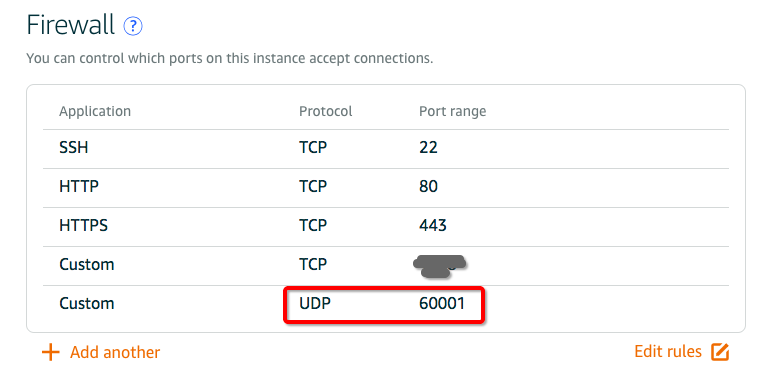
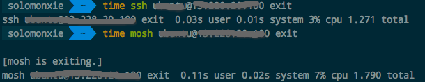

# Linux 安装Mosh代替SSH

最近用SSH访问服务器不知道为什么，总是延迟很高，打字反馈都非常慢。怎么也查不出原因，卸载关闭了所有占用网速、CPU、内存的软件也不行。结果肯定是我的小区宽带访问服务器的网络问题造成的。

经过查询发现了Mosh这个替代品，延迟极低，完全为网络不佳情况设计的，且支持率很高差评很低。
安装起来很方便。

首先在服务器端安装：
```sh
$ sudo apt-get install mosh
```

完成后，在服务器防火墙中开放60001的UDP端口（Mosh默认端口）。注意是UDP端口不是TCP端口。
具体设置根据服务器环境而定。比如我的服务器是AWS的Lightsails，那么就在网页管理后台中开放。




然后在本地机器上安装Mosh的客户端。
Mac的话，用Homebrew：
```sh
$ brew install mobile-shell
```

安装好后，直接用mosh登录服务器：
```sh
$ mosh user@ip
```

以上登录是针对默认60001端口登录的。
如果想要用不同的端口登录，需要一些设置：


登录后，真的反应极快，打字完全没有感受到延迟。且现在版本的也已经完美支持鼠标操作。

虽然实感Mosh要快很多，但是不知道为什么用`time`命令计算出来的速度就不一样：



