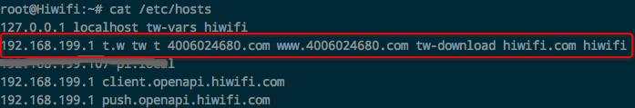
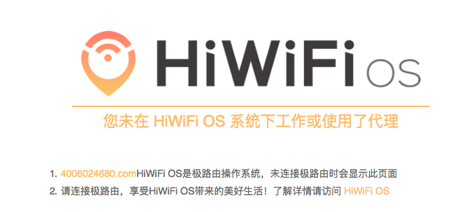
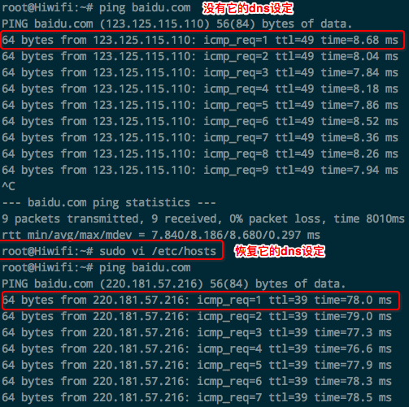
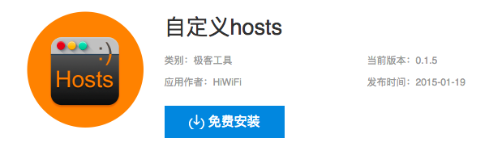

# ❖ 极路由能打开国外网却不能打开国内网

注意，本机安装了翻墙服务，所以能访问外网，证明网络没有问题。但是不能访问内网（如百度等所有国内网站）是什么玩意？

起初以为是当天我动了路由器位置，但是怎么想都不合理，不应该。所以查了一圈试了一圈路由器配置，发现都没什么改变。

怎么想都是DNS的问题，可是不管我怎么改自定义DNS，或者没有自定义DNS都无效。所以我就ssh进路由器，直接查`/etc/hosts`文件：



发现其它几个都合理可以理解，但是这个莫名其妙的`4006024680.com`是个什么东西。
然后就试着把它注释掉了——结果瞬间网络就正常了！
太莫名其妙了。
然后突然想到，前几天开启了路由器的`开发者模式`，可以ssh进路由器后台那种。而且还安装了shadowsocks插件到路由器上。以及安装了aria2插件，但是很快卸载了。
所以我的第一想法是，开发者模式在路由器上暴露在公网里，采用极路由默认端口，而且安全设置都没设置，很容易被黑。
另一个想法就是，安装的这些插件，哪个耍流氓给我加了hosts映射。

但是前几天装了插件一直没事，为什么突然今天而不是昨天呢？也不够合理，插件们会后台自动联络远程自动给我更新hosts吗？
然后查了查`www.4006024680.com`这个，显示：



果然，不是被黑，而是极路由的某种设置。
也许这个DNS设定一直就存在于hosts文件中，只不过这个DNS今天出问题了。所以把它剔除掉就好了。


## 更新
经过测试，正常情况下如果没有
```
192.168.199.1 t.w tw t 4006024680.com www.4006024680.com tw-download hiwifi.com hiwifi
```
这个DNS设定的话，直接从路由器执行`ping baidu.com`是平均7ms。但是有了它后，慢了**10倍**：平均70ms以上。




而且，注释掉、删除掉后，系统不知道什么时候还会偷偷的自动把它恢复。

## 更新
经过测试，有可能是插件引起的。删除掉了所有额外的插件，发现只有变动`自定义Hosts`这个插件才会导致`/etc/hosts`里面的dns设置。删除掉这个插件，发现dns就不会被改了。



