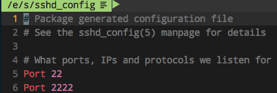

# SSH修改端口
`#ssh端口修改`

一般Linux都是默认用的`OpenSSH`作为SSH服务，所以都是修改`/etc/ssh/sshd_config`这个配置文件。

简单在`Port 22`下面加一句`Port 2222`或任意端口号，保存退出。



然后重启`sshd`服务：
```sh
# Ubuntu
$ sudo service sshd restart

# Raspbian
$ sudo systemctl restart ssh
```
